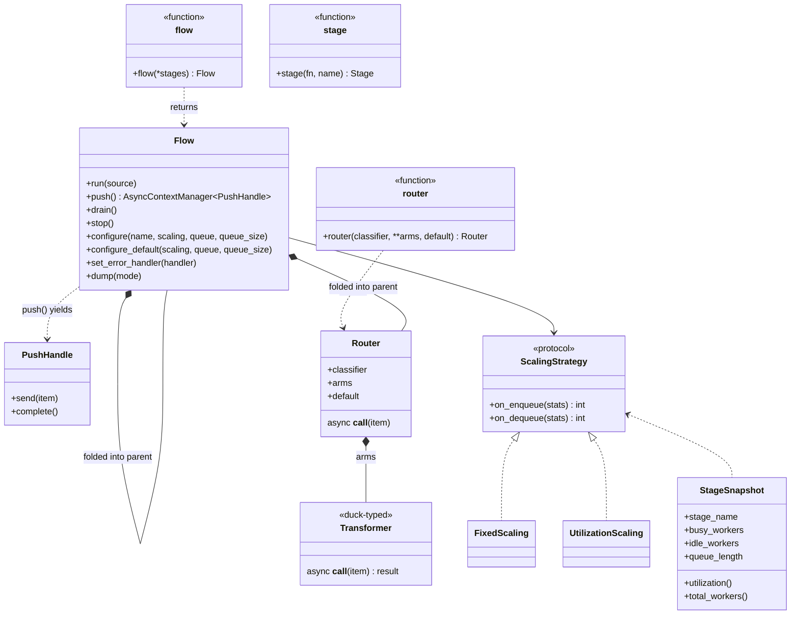

# Design

The design contract for flowrhythm — what's been decided, what's still open, and what's deferred for later.

This is the source of truth for **how the library should behave**. The README documents the user-facing surface; this document documents the rules behind it. Concrete implementation work lives in [`todos/`](todos/INDEX.md).

---

## Decided design

### DSL
- Single entry point: `flow(*stages, on_error=None, default_scaling=None, default_queue=None, default_queue_size=None)` — lowercase function, returns a `Flow` instance
- `Flow` (uppercase class) is exported for type hints only — users always construct via `flow(...)`, never via `Flow(...)`
- No separate `pipe()` / `Builder` concept — `flow()` is both structure and runnable
- **`flow()` accepts only transformers as positional args** — passing an async generator at any position is an error; the producer is supplied separately via `run()`
- Sink is **implicit** — the last stage in `flow()` plays the sink role when run autonomously (output dropped). The same flow used as a transformer in another flow forwards its last stage's output into the parent's downstream queue.
- Stage names auto-derived from function names; collisions get numeric suffix; override via `stage(fn, name=...)`

#### Flow-level config: constructor kwargs vs methods
The constructor accepts four keyword arguments as shorthand:
- `on_error=` — equivalent to calling `chain.set_error_handler(handler)` after construction
- `default_scaling=` — equivalent to `chain.configure_default(scaling=...)`
- `default_queue=` — equivalent to `chain.configure_default(queue=...)`
- `default_queue_size=` — equivalent to `chain.configure_default(queue_size=...)`

Both forms are fully equivalent. Use the constructor form for one-shot setup; use the methods for incremental configuration (e.g., when reading from a config file). Per-stage configuration (`chain.configure("stage_name", ...)`) is method-only — there's no way to express it via constructor kwargs.

### Drive modes
A `Flow` is symmetric — only how you activate it differs. Three modes, all on the same `Flow` instance:

| Mode | API | Item source | Termination |
|---|---|---|---|
| **Bounded autonomous** | `await chain.run(source)` | Caller passes async generator (or CM factory yielding one) | Source exhausts → drain → exit |
| **Unbounded autonomous** | `await chain.run()` | Framework auto-emits `None` signals indefinitely | External `chain.stop()` or first stage raises |
| **Push** | `async with chain.push() as handle: await handle.send(item)` | Caller pushes via the handle | `handle.complete()` (explicit or via `async with` exit) |

`Flow` exposes **activation modes** (`run`, `push`) but does not expose `send`/`complete` directly. Push mode returns a separate `PushHandle` type via `chain.push()`; `send()` and `complete()` live on `PushHandle`.

`stop()` is always available on `Flow` for graceful shutdown regardless of mode.

#### Why a separate PushHandle type
`send()` only makes sense when the flow has been activated in push mode. If `send()` lived on `Flow`, users could call it before (or instead of) entering `chain.push()`, requiring runtime mode-locking and producing confusing errors. Returning a separate `PushHandle` type from `chain.push()` makes the type system enforce the rule — `Flow` has no `send()` method, so the mistake is structurally impossible. No runtime mode tracking, no wrong-mode exceptions, no docs to read.

#### Auto-emit rate (unbounded `run()`)
The unbounded mode is implemented as a tight loop putting `None` into the first stage's queue. Because the default queue size is 1, `put()` blocks until the previous `None` has been consumed — backpressure naturally throttles emission. Result: emission rate = whatever the first stage can sustain.

No special timing logic, no rate config. Users who want different behavior have two levers:
- **Burstier emission** — `chain.configure("first_stage", queue_size=N)` lets the framework buffer N `None`s ahead
- **Rate-limited emission** — add `await asyncio.sleep(...)` inside the user's first transformer (the fetcher)

### Routing
- `router(classifier, **arms, default=..., name=...)` — branching expanded as a sub-graph at construction (NOT a per-item function call)
- The classifier runs as a single stage that dispatches each item to one arm's input queue
- Arms can be plain async functions, CM factories, or `Flow` sub-pipelines — each gets its own input queue and worker pool
- All arm outputs converge into the same merge queue (the stage right after the router in the parent)
- If the classifier returns a label with no matching arm and no `default`, the item is dropped and the error handler receives a `Dropped(reason=DropReason.ROUTER_MISS)` event (observer-only — pipeline continues)
- A classifier returning `Last(value)` is rejected with `TypeError` (routed to the handler as a `TransformerError`). Classifiers must return labels, not termination markers; to terminate from within a router, the corresponding arm transformer should return `Last(value)`, or call `Flow.stop()` externally.
- Nested routers are supported: an arm can be a `Flow` containing another router. The inner router's terminal stages (its merge stage, or its arm-ends if no inner merge) become the outer arm's "ends" feeding the outer merge.

#### Router naming

Naming precedence for the classifier stage (most specific wins):

1. `stage(router(...), name="X")` — explicit wrapper
2. `router(..., name="Y")` — kwarg on the factory
3. `classifier.__name__` — auto-derived (skipped for lambdas, where `__name__` is `"<lambda>"`)
4. Fallback `_router_N` — N is a per-flow counter

The chosen name becomes the prefix for arm stages (`<router_name>.<arm_label>` for callable arms; `<router_name>.<arm_label>.<sub_stage>` for sub-flow arms). Arm prefixes are made unique at expansion time (before arm stages are added) so two routers auto-deriving to the same classifier name produce consistent names: e.g. `classify`, `classify.a`, `classify_2`, `classify_2.b` (not `classify`, `classify.a`, `classify_2`, `classify.b`, which would be a confusing dump).

Reserved kwarg names on `router()`: `default`, `name`. These cannot be used as arm labels (no real-world conflict since arm labels are usually domain words, not config words).

### Composability
- A `Flow` plugs into another `flow()` as a stage
- Sub-flows are first-class — framework discriminates them for diagnostics

### Transformer (tagged union)
A Transformer is one of three concrete kinds:
1. `Flow` — a sub-pipeline (introspectable for `dump()`, etc.)
2. `AsyncContextManager[Callable]` — for resources that need acquire/release
3. `Callable[[item], Awaitable[item]]` — plain async function

Plus `router(...)` results, which are also first-class for introspection.

### Async-only
- All transformers and context managers must be async (`async def`, `AsyncContextManager`)
- Sync code is rejected at construction with a clear error pointing to `asyncio.to_thread` or the `sync_stage()` helper
- Rationale: library is asyncio-native and orchestrates external work; sync blocks the event loop and defeats the purpose

### Resource scope
- Async context managers are **per-worker** — each worker enters its own context on startup, exits on shutdown
- Context lifecycle = worker lifecycle. Resources are acquired lazily as workers spawn, released as workers exit.
- Scale-to-zero is supported. When the last worker exits, the resource is released. First item after a `0→1` transition pays the acquire cost.
- Shared resources (pools, models) are managed outside the framework

### AsyncContextManager Transformer shape
A context-managed transformer is a **factory** — a no-arg callable that returns a fresh `AsyncContextManager` whose `__aenter__` yields the actual transformer callable. The framework calls the factory once per worker.

```python
TransformerFn  = Callable[[Any], Awaitable[Any]]
TransformerCMF = Callable[[], AsyncContextManager[TransformerFn]]
```

Accepted forms:
- `@asynccontextmanager`-decorated function (most common)
- A class whose constructor takes no args and which implements `__aenter__`/`__aexit__` — instantiated as `cls()` per worker
- Any callable matching the factory shape (e.g., `lambda: MyT(args)`)

Per-worker state without resource lifecycle: yield a closure capturing local state from the CM body. No special case needed.

**Producer as CM** is also supported — single producer means single CM entered once. Same factory shape, but the inner yielded value is an async generator (or async fetcher).

### Composition (sub-flows)
Composing a `Flow` into another `flow()` is **graph-level inlining**, not a function call. The sub-flow's stages are stitched into the parent's pipeline graph; each retains its own queue, worker pool, scaling strategy, and configuration. No correlation, no per-item return value — items flow queue-to-queue.

The same `Flow` definition works **standalone** (`await inner.run(source)`) or **composed** (`flow(parent_stage, inner, sink)`) — its behavior is identical in both cases. There is no "transformer mode" vs "standalone mode."

`Flow` is therefore **not a Transformer** in the call-shape sense. It is a sub-pipeline that the framework expands during construction. The Transformer call-shape protocol applies only to plain async functions, CM factories, and `Router`.

#### Inlining algorithm

When `flow(stages...)` encounters a `Flow` in its args, it expands that sub-flow into the parent's stage list at construction time:

1. **Pick a name for the sub-flow** (call it the *prefix*)
   - Preferred: `stage(inner, name="ingest")` — explicit, clear, stable
   - Fallback: if user passes the sub-flow without `stage(..., name=...)`, framework assigns `_subflow_N` (where N is the sub-flow's positional index in the parent). Functional but ugly — docs recommend the explicit form.
2. **Expand each sub-stage** into the parent's stage list, with name prefixed: `<prefix>.<sub_stage_name>` (e.g., `ingest.decode`, `ingest.validate`)
3. **Carry over per-stage configuration** from the sub-flow into the parent's config map under the prefixed names
4. **Recurse** — a sub-flow inside a sub-flow expands the same way; names compose dotted (`outer.middle.inner.stage`)

#### Configuration merge order

When the same prefixed stage name has configuration from both the sub-flow and the parent, **the most-specific override wins** (parent's explicit `configure()` beats the sub-flow's pre-existing config):

```python
inner.configure("decode", scaling=FixedScaling(workers=4))      # set on inner
outer = flow(stage(inner, name="x"), sink)
outer.configure("x.decode", scaling=FixedScaling(workers=8))    # overrides inner
# Effective: x.decode runs with workers=8
```

If the parent doesn't override, the sub-flow's config carries through unchanged. Order: standard "most-specific wins" pattern (matches CSS, layered config files, etc.).

#### Sub-flow autonomy: what carries over and what doesn't

A sub-flow is **mostly autonomous** — its per-stage configuration and pipeline-wide defaults survive composition so the same `Flow` definition behaves identically standalone or composed (a stated guarantee). Two carve-outs apply.

**Carries over** (sub-flow is autonomous):
- **Per-stage `configure()` calls** on the sub-flow → folded into the parent's config map under prefixed names (`x.decode`). Parent can override.
- **Sub-flow's `default_scaling` / `default_queue` / `default_queue_size`** → resolved at inlining time into explicit per-stage entries for each sub-stage. So if `inner = flow(parse, validate, default_scaling=FixedScaling(workers=4))`, the inliner stores `{"x.parse": {"scaling": FixedScaling(4)}, "x.validate": {"scaling": FixedScaling(4)}}` in the parent. Sub-stages still run with 4 workers; the sub-flow's defaults do **not** leak into the parent's "default-for-everything-else" namespace.

**Discarded** (parent dominates):
- **Sub-flow's `on_error`** → discarded. The parent's error handler always wins. Error handling is an *activation* concern (one handler per pipeline, per existing rule), and only the outermost flow activates. The sub-flow's handler matters only when the sub-flow is run standalone.
- **Sub-flow's activation methods** (`run()`, `push()`, `drain()`, `stop()`) — calling these on an embedded sub-flow is an error in spirit, though not currently enforced. Activation belongs to the outermost flow; the sub-flow has no live `_current_run` while embedded.

**Empty sub-flow** (zero stages): no-op. The inliner skips it. No prefix is consumed; positional indices for the `_subflow_N` fallback advance regardless.

#### Name collisions

Top-level stages and sub-stages live in different namespaces, so collision is impossible by construction:
- `outer.normalize` (top-level) and `outer.x.normalize` (inside sub-flow `x`) are different addresses
- Two sub-flows wrapped under different names (`stage(s1, name="a")`, `stage(s2, name="b")`) get `a.normalize` and `b.normalize` — also different addresses

The only collision case is **two unwrapped sub-flows** at the same level (both falling back to `_subflow_N`) — distinct because of the index. No special-case logic needed.

### Stage role detection
At construction, `flow()` validates each stage. Async generators are rejected — they belong to `run()` as the producer, not in the chain.

```python
if inspect.isasyncgenfunction(stage):
    raise TypeError("flow() does not accept async generators; pass producers to run() instead")
elif isinstance(stage, Flow):           shape = subflow   # graph-inlined, not called
elif isinstance(stage, Router):         shape = router
elif callable(stage):
    n = len(inspect.signature(stage).parameters)
    if n == 0:   shape = ctx_factory   # 0 args → returns AsyncContextManager
    elif n == 1: shape = transformer   # 1 arg → takes item
    else:        raise TypeError(...)
```

Sync functions and sync context managers are rejected with a clear error pointing to `asyncio.to_thread` or `sync_stage()`.

The **last stage** in `flow()` plays the sink role when run autonomously — its output is dropped. When the same flow is used as a transformer in another flow, the last stage's output is forwarded to the parent's downstream queue. No marking required.

### Source argument shape (run)
`run(source)` accepts only the generator function (or CM factory) — never an already-instantiated generator. Rationale:
- Framework owns iteration, allowing future re-iteration / retry semantics
- Symmetry with CM-factory sources (which must be factories)
- Prevents footgun where a generator would be partially consumed before `run()` is called

If user passes a called generator (`items()`), framework raises:
```
TypeError: pass the generator function, not the called generator.
e.g., chain.run(my_items)  not  chain.run(my_items())
```

Detection: if `inspect.isasyncgen(source)` (instantiated generator), raise. If `inspect.isasyncgenfunction(source)` (function), accept. If callable returning AsyncContextManager (CM factory), accept.

### Scaling
- **Producers** always have exactly one worker (cannot scale). Async generators are not safe to consume concurrently — duplicates or races.
- For parallel ingestion (Kafka consumer, paginated API), use a trigger producer + multi-worker transformer pattern:
  ```python
  async def trigger():
      while True: yield None
  async def fetch(_): return await kafka.poll()
  main = flow(trigger, fetch, ...)
  main.configure("fetch", scaling=UtilizationScaling(min_workers=4))
  ```
- **Transformers and sinks** can scale, including `min_workers=0` (scale-to-zero)
- Default scaling: `FixedScaling(workers=1)` if no configuration is provided
- `FixedScaling(workers=N)` requires `N >= 1` (it's fixed, not elastic — use `UtilizationScaling` for scale-to-zero)
- `UtilizationScaling(min_workers=M)` allows `M >= 0`
- Validation at construction; raise `ValueError` on invalid combinations

### Configuration (separate from definition)
- `flow.configure(name, scaling=..., queue=..., queue_size=...)` — per-stage tuning
- `flow.configure_default(scaling=..., queue=..., queue_size=...)` — pipeline-wide defaults

`queue=` is a queue **factory** (e.g. `fifo_queue`, `priority_queue`); `queue_size=` is the queue's `maxsize`. The two are independent — set either or both. Internally the framework calls `queue(maxsize=queue_size)` to build the per-stage instance. For exotic queue configs (e.g. priority queue with custom comparator), pass a pre-configured factory in `queue=` and omit `queue_size`.
- `flow.set_error_handler(handler)` — one per pipeline, last resort

### Architecture rules
- Stream processing pipeline, not a workflow engine
- DAG only — no cycles, all paths terminate at sink
- Orchestrator, not a worker — coordinates external heavy work, not CPU-bound Python computation
- Retry/iteration belongs inside a stage, not in graph topology

### Error handling
- Two layers: handle inside transformer (preferred), pipeline error handler (last resort)
- Built-in exceptions only — no custom hierarchy
- Error handler receives **typed events**, not raw `(item, exception)` tuples
- **Handler is observer-only** (see "Error handler is observer-only" below): it logs / accounts / forwards but does not control pipeline flow. Raising from the handler is treated as a handler bug — the exception is logged to stderr; the failed item stays dropped (it was already not delivered downstream); the pipeline continues. To stop a run, call `Flow.stop()` from outside.
- Default behavior when no handler is set (`default_handler` in `_errors.py`):
  - `TransformerError` → log to stderr, continue
  - `SourceError` → log to stderr, continue (source is exhausted; pipeline drains)
  - `Dropped` → silent continue

#### Error handler is observer-only

The error handler is **purely an observer** — it can log errors, increment metrics, push failed items to a dead-letter queue, etc. It does NOT control flow:

- **Handler returns normally** → pipeline continues; failed item is dropped
- **Handler raises** → exception is logged to stderr; pipeline still continues; failed item stays dropped

Why this design (we considered the alternative where handler-raise = abort and rejected it):

| Use case | Frequency | Observer-only fits? | Raise-aborts fits? |
|---|---|---|---|
| Log errors to stderr / file | very common | ✓ | ⚠ logger glitch aborts the whole run |
| Count errors / push metrics | very common | ✓ | ⚠ metric backend glitch aborts |
| Dead-letter queue (push failed items elsewhere) | common | ✓ | ⚠ DLQ outage aborts |
| Threshold-based abort ("too many errors → stop") | rare | needs `Flow.stop()` from outside | ✓ |

Most real handlers (90%+) are observers; their bugs should not have outsized blast radius. The threshold-based-abort case is rare and has a clean external pattern using `Flow.stop()`. Conflating "handler did something unexpected" with "user wants to abort" makes handler bugs catastrophic.

#### Symmetry argument

When a transformer raises, the failed item is **redirected** from its downstream queue to the error handler — the handler is effectively the sink for failed items. By symmetry, when the handler itself fails, the item is already AT the sink and has nowhere to go: drop it. Aborting the entire pipeline because a sink had a glitch would be wildly disproportionate.

#### Stopping a run from inside the handler

If a user genuinely needs the threshold-abort pattern, the clean approach is to track state outside the handler and call `Flow.stop()` (M5):

```python
errors = 0

async def on_error(event):
    nonlocal errors
    errors += 1

# In main code, alongside the run task:
run_task = asyncio.create_task(chain.run(items))
while not run_task.done():
    if errors > 100:
        await chain.stop()
        break
    await asyncio.sleep(0.5)
await run_task
```

This separates "observe errors" (handler) from "decide to stop" (caller of `Flow.stop()`).

#### Event types (initial set)
```python
@dataclass
class TransformerError:
    item: Any
    exception: Exception
    stage: str

@dataclass
class SourceError:
    exception: Exception

@dataclass
class Dropped:
    item: Any
    stage: str
    reason: DropReason   # enum
```

`DropReason` enum:
- `UPSTREAM_TERMINATED` — `Last(value)` upstream caused this item to be discarded
- `ROUTER_MISS` — router classifier returned an unknown arm and there was no `default`

### Termination
- **`Last(value)`** — wrapper a transformer can return to mean "this is the absolute last item." `value` flows downstream as the final item; everything still upstream of this transformer is dropped (each dropped item generates a `Dropped` event).
- **`chain.run(source)` returns naturally** when source generator completes — graceful drain.
- **`chain.drain()`** — graceful from outside (only meaningful in unbounded `run()` mode where there's no source the user controls).
- **`chain.stop()`** — immediate abort; resources released, items in flight dropped.
- **Source generator raises** — handler receives a `SourceError` event. Default handler logs to stderr and lets the pipeline drain (source is treated as exhausted). To abort instead, call `Flow.stop()` from outside the run.

### Lifecycle
- Public API: `run(source)`, `run()`, `push()`, `drain()`, `stop()` only
- `start()` / `join()` are internal — used by `run()` and `push()` but not exposed. There is no legitimate user scenario for them; every way of feeding items into a flow is covered by the public methods. Hiding them keeps the surface minimal and prevents misuse (leaked workers, undefined-state mode mixing).

### Queue type
- Pipeline-wide default + per-stage override
- Built-in: `fifo_queue`, `lifo_queue`, `priority_queue`

### Queue size and backpressure
- **Default `maxsize=1`** for every stage's input queue
- Rationale: aggressive backpressure pairs naturally with `UtilizationScaling` (queue length swings between 0 and 1; scaling decisions key off worker utilization, not buffer growth) and keeps memory predictable (N stages × N workers × 1)
- A stalled downstream is visible as "everything blocked" within one item, not after a hundred buffered ones — early signal that something is off
- Per-stage override available via `chain.configure(name, queue_size=N)` for stages where bursty buffering genuinely helps
- Unbounded queues (`maxsize=0`) are NOT a default — must be explicitly opted into per stage; comes with OOM risk if downstream stalls

### EOF / drain cascade
End-of-stream propagates through the pipeline by **shutting down queues**, not by emitting sentinel items. Built directly on **stdlib `asyncio.Queue.shutdown()`** (Python 3.13+). LIFO and Priority queue variants inherit `shutdown()` from `asyncio.Queue` — no custom subclass needed.

After `queue.shutdown(immediate=False)`:
- `get()` returns any remaining items first; once the queue is empty, `get()` raises `QueueShutDown`
- `put()` raises `QueueShutDown` immediately; blocked `put()` callers are unblocked and raise

After `queue.shutdown(immediate=True)`:
- Queue is drained; all blocked `get()` callers unblock and raise `QueueShutDown`
- Used for `Flow.stop()` (abort path)

The drain cascade (graceful, `shutdown(immediate=False)`):
1. Trigger event happens (source generator returns; `Last(value)` returned by a transformer; `chain.drain()` called)
2. Framework calls `shutdown(immediate=False)` on the affected queue (source's destination, the stage after `Last`'s output, etc.)
3. Workers naturally drain remaining items, then their next `get()` raises `QueueShutDown` and they exit
4. Each stage's tracker watches its alive worker count; when count drops to 0, the stage's downstream queue is shut down
5. Cascade continues until the last stage exits

No item is dropped during a graceful drain — everything queued at the moment of `shutdown()` is still processed. In-flight items in workers complete normally.

The abort cascade (`Flow.stop()`):
- Framework calls `shutdown(immediate=True)` on every stage's queue at once
- All workers awaiting `get()` unblock and raise; in-flight workers complete current item, then `__aexit__` runs on their CMs (resources always released)
- Returns when no workers are alive

#### Race-free against scaling
- Workers exit independently — no per-stage worker counter for the cascade to track (the per-stage tracker only watches "alive count → 0")
- Scaling strategy is told "input shutting down" so it stops scaling up (down-scaling is fine; workers exit anyway)
- A worker spawned mid-drain immediately hits `get()` and either picks an in-flight item or exits cleanly — no hang, no leak
- A worker mid-`put()` to a downstream queue is unaffected; downstream queue is shut down only after this stage finishes

### Worker pool internals

Each stage owns a worker pool. The runtime needs to:
1. Know how many workers to run (driven by the scaling strategy)
2. Spawn / retire workers as the strategy decides
3. Cancel workers safely when needed (scale-to-zero, `Flow.stop()`)
4. Distinguish workers that are safe to cancel from those that aren't
5. Expose state for `dump(mode="stats")` and debugging

#### Worker lifecycle states

A worker passes through these states during its life:

| # | State | What the worker is doing | Safe to cancel? | Why |
|---|---|---|---|---|
| 1 | **Spawning** | Task created, body not yet entered | Trivially safe (nothing to clean up) | — |
| 2 | **Initializing CM** | `__aenter__` running (M3+) | **No** | Partial `__aenter__` does NOT trigger `__aexit__`; cancellation here leaks resources |
| 3 | **`waiting_input`** | Blocked on `my_queue.get()` | **Yes** | No item in flight, no resource state mid-mutation |
| 4 | **`processing`** | `await fn(item)` running | **No** | Cancellation = item loss + user transformer interrupted mid-call |
| 5 | **`waiting_output`** | Blocked on `next_queue.put(result)` | **No** | Holds an undelivered result; cancellation = result loss |
| 6 | **Tearing down CM** | `__aexit__` running | **No** | Interrupting cleanup defeats its purpose |

Only state 3 (`waiting_input`) is safe to cancel. All other states must exit voluntarily or via `Flow.stop()` (which is the abort path; item loss accepted there).

`dump(mode="stats")` exposes per-stage counts of workers in each state, plus the queue's open/shut-down status, so users can diagnose stalls (e.g., "8 workers all `waiting_output`" → downstream is the bottleneck).

#### Worker tracking

Per stage, two task sets:

- `all_workers[i]: set[asyncio.Task]` — every alive worker task. Used by `Flow.stop()` to cancel everyone, and to compute `alive[i] = len(all_workers[i])`.
- `idle_workers[i]: set[asyncio.Task]` — subset currently in state 3 (`waiting_input`). The only set targeted by routine cancellation.

Workers self-register and self-unregister around their `await get()`:

```python
idle_workers[i].add(my_task)
try:
    item = await queues[i].get()
except (asyncio.QueueShutDown, asyncio.CancelledError):
    return  # clean exit
finally:
    idle_workers[i].discard(my_task)
```

The `add()` → `await get()` sequence has no `await` between them, so any `task.cancel()` arriving in that window fires at `get()` (the next await), which is correctly caught.

#### Pool sizing: `target` vs `alive`

Two-counter declarative design — `target` is what the system should look like, `alive` is what it currently looks like:

```python
target[i] = strategy.initial_workers()
alive[i]  = len(all_workers[i])  # derived
```

When `strategy.on_enqueue()` / `on_dequeue()` returns a delta:

```python
target[i] = max(0, target[i] + delta)
diff = target[i] - alive[i]
if diff > 0:
    for _ in range(diff):
        spawn worker; alive grows when task added to all_workers[i]
# if diff < 0: see retirement mechanisms below
```

#### Retirement mechanisms (two paths)

Two ways a worker can voluntarily exit when `target[i] < alive[i]`:

| Path | When used | How |
|---|---|---|
| **Polling** | `target[i] > 0` (partial scale-down) | At top of worker loop, check `if alive[i] > target[i]: return`. Simple, no task-tracking required. Idle workers retire on their next item or shutdown. |
| **Targeted cancel** | `target[i] == 0` (scale-to-zero) | Pick a task from `idle_workers[i]` and call `.cancel()`. Required because pure polling can't wake idle workers blocked on `get()` with no incoming items. |

The polling check happens **before** the worker registers itself as idle, so a fast scale-down doesn't have to cancel anything — it lands on the next loop iteration.

#### Why this design is safe under all paths

| Scenario | Behavior |
|---|---|
| Polling fires at top of loop | Worker decrements `alive`, returns. Clean. |
| Worker in `idle_workers[i]` + targeted cancel | `CancelledError` at `get()`, caught, clean exit |
| Worker just left `idle_workers[i]` (got an item) + targeted cancel | Not in set → not cancelled. Polling on next iteration catches it. |
| Worker in CM init (state 2) + retire signal | Not in `idle_workers[i]` → not cancelled. Init completes; polling retires it on first loop iteration. |
| `Flow.stop()` (abort) | `shutdown(immediate=True)` on every queue + cancel all `all_workers[i]`. Item loss is acceptable in abort path. |

#### Asyncio safety notes

- `asyncio` is single-threaded cooperative — plain `int` and `set` operations are safe between `await` points.
- The polling check (`if alive[i] > target[i]: alive[i] -= 1; return`) has no `await` between read and write — no interleaving possible.
- The `set.add()` → `await get()` window has no `await` — cancellation can't fire in the gap, only at the await.
- This safety relies on the runtime functions (the polling check, the add/discard around get(), the strategy-call + counter-update window) staying synchronous. The `ScalingStrategy` Protocol declares its methods as `def`, not `async def`, specifically to preserve this invariant.
- **Error-handling catches use `except Exception`, never `except BaseException`.** `asyncio.CancelledError` extends `BaseException` (not `Exception`) so `except Exception` doesn't swallow it — preserving cooperative cancellation. The framework wraps the user's transformer, source, and error handler in `except Exception`; cancellation propagates through to `Flow.stop()`'s shutdown cascade and worker retirement. The single intentional exception is the worker's `await queue.get()`, where `CancelledError` IS the deliberate retirement signal — that catch is `except (asyncio.QueueShutDown, asyncio.CancelledError):`.

#### Strategy contract: synchronous by design

`ScalingStrategy.on_enqueue()` / `on_dequeue()` are **synchronous**. Built-in strategies (`FixedScaling`, `UtilizationScaling`) are sync; custom strategies must also be sync. Reasons:

- **Hot-path performance** — strategies are called on every item event, potentially millions of calls/sec. async dispatch overhead is wasteful.
- **Race-condition safety** — sync strategies cannot suspend, so the strategy-call + counter-update sequence stays atomic. No locks needed; no double-scaling races.
- **Forces correct design** — putting `await something()` on the hot path is an anti-pattern. If a strategy needs external state (config, remote metric), refresh it in a background task and read the cached value sync here.

If a future need genuinely requires the strategy to invoke async work, that work belongs in a separate background task that updates state the strategy can read. Don't change the protocol to `async`.

#### Per-stage state organization

Per-stage runtime state lives in a **`_StageRuntime` dataclass**, not as parallel lists on `_FlowRun`. One dataclass instance per stage holds: the queue, scaling strategy, function, name, target / alive / busy counters, the input-drained flag, and the `all_workers` / `idle_workers` task sets.

Why a dataclass:
- **Adding new per-stage state** (e.g. M3's per-worker CM context, M9/M10's timestamps) only touches one definition, not N parallel-list initializers and update sites scattered around the runner
- **Worker code reads as `s.alive`, `s.queue`, `s.busy`** — locality of reference. Parallel lists fragment one stage's state across many attributes on the runner.
- **Lifetimes are clear**: `_FlowRun.__init__` builds its own list of `_StageRuntime` from `Flow`'s resolved config. Mutated by the runner's tasks. Garbage-collected when the run completes.

`_FlowRun` itself only carries run-level state (source, the per-stage list, done event, source-finished flag). Anything per-stage belongs on `_StageRuntime`.

#### Run completion: state-driven, not task-driven

`Flow.run()` cannot use `asyncio.gather` or `asyncio.TaskGroup` to wait for completion. Workers come and go dynamically (UtilizationScaling spawns mid-run); a fixed task list doesn't fit. Instead, completion is detected from **runtime state**:

```python
done_event = asyncio.Event()

def check_done():
    if source_finished and all(a == 0 for a in alive):
        done_event.set()

# Spawn fire-and-forget; no list to wait on
for stage_idx in range(n):
    for _ in range(target[stage_idx]):
        asyncio.create_task(worker_task(stage_idx))
asyncio.create_task(source_task())

await done_event.wait()
```

Each worker (and the source task) calls `check_done()` in its `finally` block after decrementing its `alive` counter. The first invocation that finds the done condition true sets the event.

This:
- Keeps task management fully dynamic (no list, no group, no gather)
- Makes the "we're done" condition a property of state — easy to reason about and to expose via `dump(stats)`
- Lets `Flow.stop()` (M5) work the same way: it triggers `shutdown(immediate=True)` on every queue, then targeted-cancels every task in `all_workers[i]`; workers exit, alive counters drop to 0, `done_event` fires, run returns.

#### Exception handling within tasks (deferred to M4)

Workers and the source task may raise. Python guarantees `finally` blocks run on exception, so cleanup (alive decrement, queue shutdown) happens regardless. The pipeline drains naturally — `run()` does not deadlock.

What about surfacing the exception to the caller of `run()`?

- **M2c (current):** uncaught exceptions in tasks are logged by asyncio's default unhandled-exception handler. `run()` returns normally when state reaches "done." The user sees a stderr log but no Python exception from `run()`. This is incomplete UX but does not corrupt state.
- **M4 (next):** the runtime wraps every transformer call in `try/except`, routes exceptions to the typed-events error handler (`TransformerError`, `SourceError`), and the handler decides policy (raise = abort and re-raise from `run()`, return = continue). M4 supersedes the M2c gap.

Adding ad-hoc exception capture in M2c would just be replaced by M4's machinery. The minimal M2c design — no exception cell, no fail-fast — is intentional.

### Component class diagram

The full type structure: factory functions, the `Flow` and `Router` classes, the `PushHandle` returned from push mode, the `Transformer` duck-typed shape, and the `ScalingStrategy` protocol with built-in implementations.



---

## Invariants

Internal facts the runtime must maintain. Each invariant is the load-bearing reason a guarantee in README's "Guarantees" section holds, or a rule the implementation relies on for safety. Tests and `assert` sites reference invariants by number (`test_I3_*`, `assert ...  # I3`).

Invariants are added incrementally — when a milestone establishes or modifies one, update this section as part of milestone exit (see [`docs/milestone-exit.md`](docs/milestone-exit.md)).

### I1 — `alive[i] >= 0` always

Per-stage worker count is never negative. Enforced by: `_alive` is incremented only in `_spawn_worker()` and decremented only in worker `finally` blocks; spawn is only called when `target > alive`.

### I2 — `alive[i] == len(all_workers[i])`

Counter matches set size at every event-loop boundary. Enforced by: `_spawn_worker()` adds the new task to `all_workers[i]` and increments `_alive` in the same synchronous block; worker `finally` removes self from set and decrements `_alive` in the same synchronous block. asyncio's single-threaded model makes those pairs atomic.

### I3 — `idle_workers[i] ⊆ all_workers[i]`; idle ⇔ state 3

A worker is in `idle_workers[i]` iff it is currently blocked on `queues[i].get()` (state 3 — `waiting_input`). Self-registers immediately before `await get()`, self-removes in `finally`. Used by routine cancellation to find safe-to-cancel targets.

### I4 — Routine cancellation targets only `idle_workers[i]`

Workers in CM init (state 2), processing (state 4), waiting_output (state 5), or CM teardown (state 6) are never targeted by routine `task.cancel()` — only workers in state 3. `Flow.stop()` is the one path that cancels indiscriminately; item loss is accepted there.

This is what makes interrupting CM init/teardown structurally impossible outside the abort path.

### I5 — `except Exception` preserves cancellation

All runtime try/except blocks that wrap user code or async work catch `Exception`, not `BaseException`. `asyncio.CancelledError` (which extends `BaseException`) propagates through, preserving cooperative cancellation (`task.cancel()`, `Flow.stop()`).

The single deliberate exception is the worker's `await queues[i].get()` site, where the catch is `except (asyncio.QueueShutDown, asyncio.CancelledError)` — cancellation there IS the retirement signal.

### I6 — Drain is monotonic

`input_drained[i]` transitions False → True exactly once and never reverts. Once a stage's input is marked drained, the drain cascade can rely on it without re-checking.

### I7 — Done-event correctness

`_done_event` is set iff `_source_finished == True AND alive[i] == 0 for all stages i`. Once set, never cleared. Run completion is detected from this state, not from awaiting a fixed task list (workers come and go dynamically — see DESIGN "Run completion: state-driven, not task-driven").

### I8 — Per-worker CM lifecycle

Every worker that completes its CM `__aenter__` also runs `__aexit__` before exiting — under normal drain, scale-down (polling or targeted cancel), transformer exception, or `Flow.stop()`. Enforced by structuring the worker body as `async with factory() as fn: ...`, which makes `__aexit__` non-skippable.

Backs README guarantee: *"Per-worker context managers always have `__aexit__` called when the worker stops."*

### I9 — Item conservation

Every item that enters the chain reaches a terminal state — consumed by the sink, OR delivered to the error handler as a `TransformerError` / `Dropped` event — before `run()` returns or `async with chain.push() as h:` exits.

Backs README guarantee: *"Every item that enters the chain reaches a terminal state."*

### I10 — `Last(value)` ordering (topology-aware)

When a transformer at stage `i` returns `Last(value)`, the runtime picks the **kill range** end:
- `arm_merge_idx` if stage `i` is inside a router arm (the merge of the enclosing arm — for nested arms, the OUTERMOST one wins, set at `_FlowRun.__init__` with first-wins iteration)
- otherwise `downstream_stage_idx` for normal stages, or `_n` if `i` is the last stage in the pipeline

For stages inside an arm, the kill range additionally **excludes the initiator's own downstream chain** — the stages reached by walking `downstream_stage_idx → downstream_stage_idx → ...` from `i+1` up to but not including the merge. Those must stay alive so the Last value can flow through to the merge.

The cascade then:
- Shuts down every queue in the kill range minus the initiator's chain — for routers this kills the classifier AND every sibling arm. Items still upstream are dropped (with `DropReason.UPSTREAM_TERMINATED` for source items).
- Cancels idle workers in stage `i` (state 3 — safe). Killed stages' idle workers wake from `QueueShutDown` from the same shutdown call.
- Polls until every killed stage has fully drained (alive == 0 for non-self; alive == 1 for the initiator).
- Puts `value` into the destination queue (`downstream_stage_idx`'s queue), or drops it if `downstream_stage_idx` is None.

Result: `value` enters the destination queue last; with single-worker downstream, it's the last item processed. (Multi-worker downstream → per-worker ordering not guaranteed, same caveat as elsewhere.)

For Last from anywhere inside a router arm — including the middle of a multi-stage arm sub-flow — this guarantees no sibling-arm items can sneak past `value` into the merge queue.

Backs README guarantee: *"`Last(value)` is final."*

### I11 — `_source_finished` reaches True in every mode

For `_done_event` to fire (and for `run()` / `async with chain.push()` to terminate), `_source_finished` must become True. The mechanism differs by activation mode but the post-condition is identical:

- **Source mode** (`run(source)` / `run()`): `_source_task`'s `finally` block sets `_source_finished = True` when the source generator exhausts, raises (routed to handler), or its `put` is rejected by a shut-down queue.
- **Push mode** (`async with chain.push() as h:`): there is no `_source_task`. `_source_finished` is set by `PushHandle.complete()` (via `_mark_complete`), `Flow.drain()`, or `Flow.stop()` directly.

Both paths converge on I7's done-condition. Without this invariant, push-mode `drain()` / `stop()` would hang forever (queues shut down, workers exit, alive → 0, but `_source_finished` stays False so `_done_event` never fires).

### I12 — A composed sub-flow has no runtime presence in the parent

When a `Flow` is inlined into another `flow()` at construction, only its `_stages` list and the resolved per-sub-stage config (from `_stage_config` + `_default_config`) are copied into the parent. The sub-flow's `_error_handler`, `_current_run`, and any subsequent `configure()` calls on the sub-flow object are **not** observed by the parent's `_FlowRun`.

Implications:
- Parent's `on_error` always wins for events from sub-stages — backs the "Sub-flow autonomy" carve-out.
- Activating an embedded sub-flow directly (`inner.run(...)` after `outer = flow(inner, ...)`) would create a separate `_FlowRun` on `inner`, parallel to and disconnected from `outer` — currently not enforced as an error, but never useful.
- Modifying `inner.configure(...)` after composition has no effect — the inlined config was baked at construction time.

### I13 — Merge queue drains only after all contributing arm-ends signal

A router's classifier dispatches items into N arm queues; the arms' last stages all feed a single **merge queue** (the stage right after the router in the parent). Each arm-end stage holds a "drain signal" for the merge: the merge queue's `pending_inputs` counter starts at N (one per arm-end) and is decremented by `_signal_input_drain()` whenever an arm-end fully drains (`alive == 0 AND input_drained`). The merge queue is shut down only when `pending_inputs` reaches 0.

For non-merge stages, `pending_inputs == 1` (one upstream source — the previous stage in linear order, or the source task for stage 0). The first signal shuts the queue down immediately.

Without this invariant, the first arm-end to finish would shut down the merge queue, killing items still in flight from slower arms.

---

## Open questions

- **`configure()` validation** — warn if user configures a stage name that doesn't exist in the flow?
- **Multi-source producers** — single worker per producer is decided. If a user needs multi-source ingestion, do they merge upstream (router-style), run multiple flows, or do we add parallel producers?
- **Per-stage error handling** — currently pipeline-only. Useful to override per stage, or keep simple?

## Future enhancements (deferred)

- **`source(fn)` for multi-worker producers** — explicit primitive for "fetcher" style producers (Kafka consumer, SQS poller, paginated API). Each worker calls `fn()` independently to fetch one item; multiple workers parallelize ingestion. Termination via raised `StopAsyncIteration` or sentinel return. Defer until trigger+transformer pattern proves insufficient.
- **`merge(*sources)` helper** — combine multiple async generators into one for use as a single producer.

---

