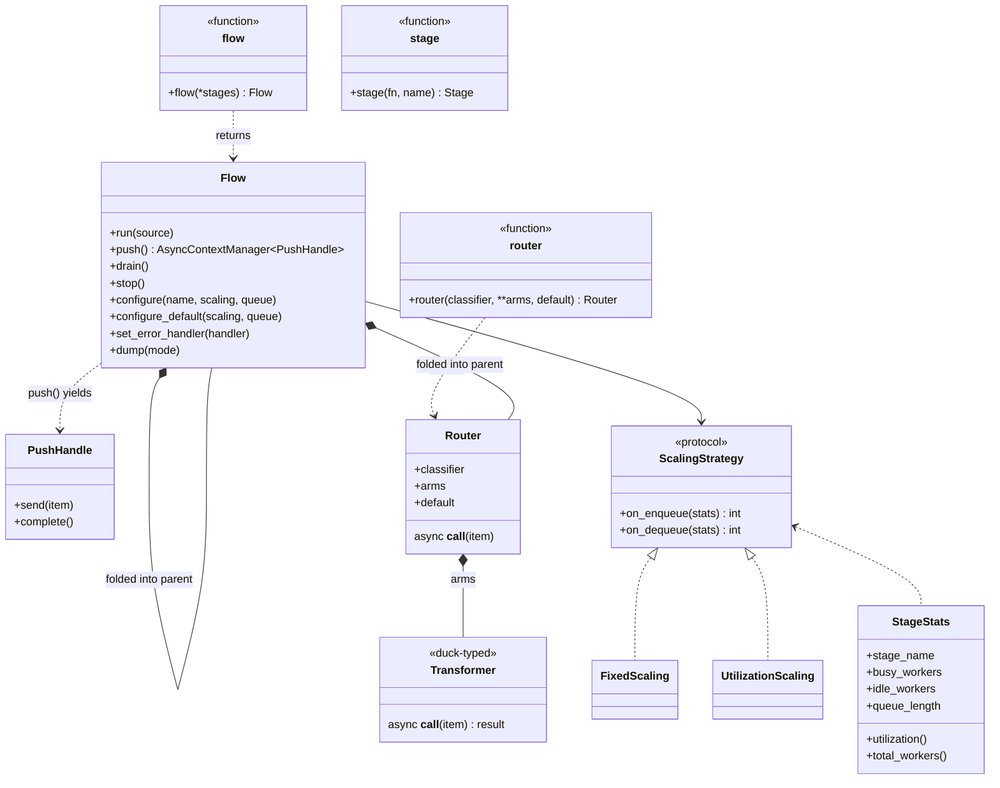

# Design

The design contract for flowrhythm — what's been decided, what's still open, and what's deferred for later.

This is the source of truth for **how the library should behave**. The README documents the user-facing surface; this document documents the rules behind it. Concrete implementation work lives in [`todos/`](todos/INDEX.md).

---

## Decided design

### DSL
- Single entry point: `flow(*stages, on_error=None, default_scaling=None, default_queue=None)` — lowercase function, returns a `Flow` instance
- `Flow` (uppercase class) is exported for type hints only — users always construct via `flow(...)`, never via `Flow(...)`
- No separate `pipe()` / `Builder` concept — `flow()` is both structure and runnable
- **`flow()` accepts only transformers as positional args** — passing an async generator at any position is an error; the producer is supplied separately via `run()`
- Sink is **implicit** — the last stage in `flow()` plays the sink role when run autonomously (output dropped). The same flow used as a transformer in another flow forwards its last stage's output into the parent's downstream queue.
- Stage names auto-derived from function names; collisions get numeric suffix; override via `stage(fn, name=...)`

#### Flow-level config: constructor kwargs vs methods
The constructor accepts three keyword arguments as shorthand:
- `on_error=` — equivalent to calling `chain.set_error_handler(handler)` after construction
- `default_scaling=` — equivalent to `chain.configure_default(scaling=...)`
- `default_queue=` — equivalent to `chain.configure_default(queue=...)`

Both forms are fully equivalent. Use the constructor form for one-shot setup; use the methods for incremental configuration (e.g., when reading from a config file). Per-stage configuration (`chain.configure("stage_name", ...)`) is method-only — there's no way to express it via constructor kwargs.

### Drive modes
A `Flow` is symmetric — only how you activate it differs. Three modes, all on the same `Flow` instance:

| Mode | API | Item source | Termination |
|---|---|---|---|
| **Bounded autonomous** | `await chain.run(source)` | Caller passes async generator (or CM factory yielding one) | Source exhausts → drain → exit |
| **Unbounded autonomous** | `await chain.run()` | Framework auto-emits `None` signals indefinitely | External `chain.stop()` or first stage raises |
| **Push** | `async with chain.push() as handle: await handle.send(item)` | Caller pushes via the handle | `handle.complete()` (explicit or via `async with` exit) |

`Flow` exposes **activation modes** (`run`, `push`) but does not expose `send`/`complete` directly. Push mode returns a separate `PushHandle` type via `chain.push()`; `send()` and `complete()` live on `PushHandle`.

`stop()` is always available on `Flow` for graceful shutdown regardless of mode.

#### Why a separate PushHandle type
`send()` only makes sense when the flow has been activated in push mode. If `send()` lived on `Flow`, users could call it before (or instead of) entering `chain.push()`, requiring runtime mode-locking and producing confusing errors. Returning a separate `PushHandle` type from `chain.push()` makes the type system enforce the rule — `Flow` has no `send()` method, so the mistake is structurally impossible. No runtime mode tracking, no wrong-mode exceptions, no docs to read.

#### Auto-emit rate (unbounded `run()`)
The unbounded mode is implemented as a tight loop putting `None` into the first stage's queue. Because the default queue size is 1, `put()` blocks until the previous `None` has been consumed — backpressure naturally throttles emission. Result: emission rate = whatever the first stage can sustain.

No special timing logic, no rate config. Users who want different behavior have two levers:
- **Burstier emission** — `chain.configure("first_stage", queue_size=N)` lets the framework buffer N `None`s ahead
- **Rate-limited emission** — add `await asyncio.sleep(...)` inside the user's first transformer (the fetcher)

### Routing
- `router(classifier, **arms, default=...)` — branching as a regular transformer
- If classifier returns unknown label and no `default`, raises `ValueError`
- Arms can be any Transformer (callable, chain, Flow)

### Composability
- A `Flow` plugs into another `flow()` as a stage
- Sub-flows are first-class — framework discriminates them for diagnostics

### Transformer (tagged union)
A Transformer is one of three concrete kinds:
1. `Flow` — a sub-pipeline (introspectable for `dump()`, etc.)
2. `AsyncContextManager[Callable]` — for resources that need acquire/release
3. `Callable[[item], Awaitable[item]]` — plain async function

Plus `router(...)` results, which are also first-class for introspection.

### Async-only
- All transformers and context managers must be async (`async def`, `AsyncContextManager`)
- Sync code is rejected at construction with a clear error pointing to `asyncio.to_thread` or the `sync_stage()` helper
- Rationale: library is asyncio-native and orchestrates external work; sync blocks the event loop and defeats the purpose

### Resource scope
- Async context managers are **per-worker** — each worker enters its own context on startup, exits on shutdown
- Context lifecycle = worker lifecycle. Resources are acquired lazily as workers spawn, released as workers exit.
- Scale-to-zero is supported. When the last worker exits, the resource is released. First item after a `0→1` transition pays the acquire cost.
- Shared resources (pools, models) are managed outside the framework

### AsyncContextManager Transformer shape
A context-managed transformer is a **factory** — a no-arg callable that returns a fresh `AsyncContextManager` whose `__aenter__` yields the actual transformer callable. The framework calls the factory once per worker.

```python
TransformerFn  = Callable[[Any], Awaitable[Any]]
TransformerCMF = Callable[[], AsyncContextManager[TransformerFn]]
```

Accepted forms:
- `@asynccontextmanager`-decorated function (most common)
- A class whose constructor takes no args and which implements `__aenter__`/`__aexit__` — instantiated as `cls()` per worker
- Any callable matching the factory shape (e.g., `lambda: MyT(args)`)

Per-worker state without resource lifecycle: yield a closure capturing local state from the CM body. No special case needed.

**Producer as CM** is also supported — single producer means single CM entered once. Same factory shape, but the inner yielded value is an async generator (or async fetcher).

### Composition (sub-flows)
Composing a `Flow` into another `flow()` is **graph-level inlining**, not a function call. The sub-flow's stages are stitched into the parent's pipeline graph; each retains its own queue, worker pool, scaling strategy, and configuration. No correlation, no per-item return value — items flow queue-to-queue.

The same `Flow` definition works **standalone** (`await inner.run(source)`) or **composed** (`flow(parent_stage, inner, sink)`) — its behavior is identical in both cases. There is no "transformer mode" vs "standalone mode."

`Flow` is therefore **not a Transformer** in the call-shape sense. It is a sub-pipeline that the framework expands during construction. The Transformer call-shape protocol applies only to plain async functions, CM factories, and `Router`.

#### Inlining algorithm

When `flow(stages...)` encounters a `Flow` in its args, it expands that sub-flow into the parent's stage list at construction time:

1. **Pick a name for the sub-flow** (call it the *prefix*)
   - Preferred: `stage(inner, name="ingest")` — explicit, clear, stable
   - Fallback: if user passes the sub-flow without `stage(..., name=...)`, framework assigns `_subflow_N` (where N is the sub-flow's positional index in the parent). Functional but ugly — docs recommend the explicit form.
2. **Expand each sub-stage** into the parent's stage list, with name prefixed: `<prefix>.<sub_stage_name>` (e.g., `ingest.decode`, `ingest.validate`)
3. **Carry over per-stage configuration** from the sub-flow into the parent's config map under the prefixed names
4. **Recurse** — a sub-flow inside a sub-flow expands the same way; names compose dotted (`outer.middle.inner.stage`)

#### Configuration merge order

When the same prefixed stage name has configuration from both the sub-flow and the parent, **the most-specific override wins** (parent's explicit `configure()` beats the sub-flow's pre-existing config):

```python
inner.configure("decode", scaling=FixedScaling(workers=4))      # set on inner
outer = flow(stage(inner, name="x"), sink)
outer.configure("x.decode", scaling=FixedScaling(workers=8))    # overrides inner
# Effective: x.decode runs with workers=8
```

If the parent doesn't override, the sub-flow's config carries through unchanged. Order: standard "most-specific wins" pattern (matches CSS, layered config files, etc.).

#### Name collisions

Top-level stages and sub-stages live in different namespaces, so collision is impossible by construction:
- `outer.normalize` (top-level) and `outer.x.normalize` (inside sub-flow `x`) are different addresses
- Two sub-flows wrapped under different names (`stage(s1, name="a")`, `stage(s2, name="b")`) get `a.normalize` and `b.normalize` — also different addresses

The only collision case is **two unwrapped sub-flows** at the same level (both falling back to `_subflow_N`) — distinct because of the index. No special-case logic needed.

### Stage role detection
At construction, `flow()` validates each stage. Async generators are rejected — they belong to `run()` as the producer, not in the chain.

```python
if inspect.isasyncgenfunction(stage):
    raise TypeError("flow() does not accept async generators; pass producers to run() instead")
elif isinstance(stage, Flow):           shape = subflow   # graph-inlined, not called
elif isinstance(stage, Router):         shape = router
elif callable(stage):
    n = len(inspect.signature(stage).parameters)
    if n == 0:   shape = ctx_factory   # 0 args → returns AsyncContextManager
    elif n == 1: shape = transformer   # 1 arg → takes item
    else:        raise TypeError(...)
```

Sync functions and sync context managers are rejected with a clear error pointing to `asyncio.to_thread` or `sync_stage()`.

The **last stage** in `flow()` plays the sink role when run autonomously — its output is dropped. When the same flow is used as a transformer in another flow, the last stage's output is forwarded to the parent's downstream queue. No marking required.

### Source argument shape (run)
`run(source)` accepts only the generator function (or CM factory) — never an already-instantiated generator. Rationale:
- Framework owns iteration, allowing future re-iteration / retry semantics
- Symmetry with CM-factory sources (which must be factories)
- Prevents footgun where a generator would be partially consumed before `run()` is called

If user passes a called generator (`items()`), framework raises:
```
TypeError: pass the generator function, not the called generator.
e.g., chain.run(my_items)  not  chain.run(my_items())
```

Detection: if `inspect.isasyncgen(source)` (instantiated generator), raise. If `inspect.isasyncgenfunction(source)` (function), accept. If callable returning AsyncContextManager (CM factory), accept.

### Scaling
- **Producers** always have exactly one worker (cannot scale). Async generators are not safe to consume concurrently — duplicates or races.
- For parallel ingestion (Kafka consumer, paginated API), use a trigger producer + multi-worker transformer pattern:
  ```python
  async def trigger():
      while True: yield None
  async def fetch(_): return await kafka.poll()
  main = flow(trigger, fetch, ...)
  main.configure("fetch", scaling=UtilizationScaling(min_workers=4))
  ```
- **Transformers and sinks** can scale, including `min_workers=0` (scale-to-zero)
- Default scaling: `FixedScaling(workers=1)` if no configuration is provided
- `FixedScaling(workers=N)` requires `N >= 1` (it's fixed, not elastic — use `UtilizationScaling` for scale-to-zero)
- `UtilizationScaling(min_workers=M)` allows `M >= 0`
- Validation at construction; raise `ValueError` on invalid combinations

### Configuration (separate from definition)
- `flow.configure(name, scaling=..., queue=...)` — per-stage tuning
- `flow.configure_default(scaling=..., queue=...)` — pipeline-wide defaults
- `flow.set_error_handler(handler)` — one per pipeline, last resort

### Architecture rules
- Stream processing pipeline, not a workflow engine
- DAG only — no cycles, all paths terminate at sink
- Orchestrator, not a worker — coordinates external heavy work, not CPU-bound Python computation
- Retry/iteration belongs inside a stage, not in graph topology

### Error handling
- Two layers: handle inside transformer (preferred), pipeline error handler (last resort)
- Built-in exceptions only — no custom hierarchy
- Error handler receives **typed events**, not raw `(item, exception)` tuples
- Handler behavior decides policy:
  - Returns normally → pipeline continues
  - Raises → pipeline aborts, exception propagates out of `run()`
- Default behavior when no handler is set:
  - `TransformerError` → log to stderr, continue
  - `SourceError` → re-raise (fatal)
  - `Dropped` → silent continue

#### Event types (initial set)
```python
@dataclass
class TransformerError:
    item: Any
    exception: Exception
    stage: str

@dataclass
class SourceError:
    exception: Exception

@dataclass
class Dropped:
    item: Any
    stage: str
    reason: DropReason   # enum
```

`DropReason` enum:
- `UPSTREAM_TERMINATED` — `Last(value)` upstream caused this item to be discarded
- `ROUTER_MISS` — router classifier returned an unknown arm and there was no `default`

### Termination
- **`Last(value)`** — wrapper a transformer can return to mean "this is the absolute last item." `value` flows downstream as the final item; everything still upstream of this transformer is dropped (each dropped item generates a `Dropped` event).
- **`chain.run(source)` returns naturally** when source generator completes — graceful drain.
- **`chain.drain()`** — graceful from outside (only meaningful in unbounded `run()` mode where there's no source the user controls).
- **`chain.stop()`** — immediate abort; resources released, items in flight dropped.
- **Source generator raises** — abort by default (re-raise from `run()`); user can wrap source for retry.

### Lifecycle
- Public API: `run(source)`, `run()`, `push()`, `drain()`, `stop()` only
- `start()` / `join()` are internal — used by `run()` and `push()` but not exposed. There is no legitimate user scenario for them; every way of feeding items into a flow is covered by the public methods. Hiding them keeps the surface minimal and prevents misuse (leaked workers, undefined-state mode mixing).

### Queue type
- Pipeline-wide default + per-stage override
- Built-in: `fifo_queue`, `lifo_queue`, `priority_queue`

### Queue size and backpressure
- **Default `maxsize=1`** for every stage's input queue
- Rationale: aggressive backpressure pairs naturally with `UtilizationScaling` (queue length swings between 0 and 1; scaling decisions key off worker utilization, not buffer growth) and keeps memory predictable (N stages × N workers × 1)
- A stalled downstream is visible as "everything blocked" within one item, not after a hundred buffered ones — early signal that something is off
- Per-stage override available via `chain.configure(name, queue_size=N)` for stages where bursty buffering genuinely helps
- Unbounded queues (`maxsize=0`) are NOT a default — must be explicitly opted into per stage; comes with OOM risk if downstream stalls

### EOF / drain cascade
End-of-stream propagates through the pipeline by **shutting down queues**, not by emitting sentinel items. Built directly on **stdlib `asyncio.Queue.shutdown()`** (Python 3.13+). LIFO and Priority queue variants inherit `shutdown()` from `asyncio.Queue` — no custom subclass needed.

After `queue.shutdown(immediate=False)`:
- `get()` returns any remaining items first; once the queue is empty, `get()` raises `QueueShutDown`
- `put()` raises `QueueShutDown` immediately; blocked `put()` callers are unblocked and raise

After `queue.shutdown(immediate=True)`:
- Queue is drained; all blocked `get()` callers unblock and raise `QueueShutDown`
- Used for `Flow.stop()` (abort path)

The drain cascade (graceful, `shutdown(immediate=False)`):
1. Trigger event happens (source generator returns; `Last(value)` returned by a transformer; `chain.drain()` called)
2. Framework calls `shutdown(immediate=False)` on the affected queue (source's destination, the stage after `Last`'s output, etc.)
3. Workers naturally drain remaining items, then their next `get()` raises `QueueShutDown` and they exit
4. Each stage's tracker watches its alive worker count; when count drops to 0, the stage's downstream queue is shut down
5. Cascade continues until the last stage exits

No item is dropped during a graceful drain — everything queued at the moment of `shutdown()` is still processed. In-flight items in workers complete normally.

The abort cascade (`Flow.stop()`):
- Framework calls `shutdown(immediate=True)` on every stage's queue at once
- All workers awaiting `get()` unblock and raise; in-flight workers complete current item, then `__aexit__` runs on their CMs (resources always released)
- Returns when no workers are alive

#### Worker states (useful for `dump()` and debugging)
At any moment, a worker is in one of three states:

| State | What the worker is doing | Affected by input-queue `shutdown()`? |
|---|---|---|
| **`waiting_input`** | Blocked on `my_queue.get()` | Yes — graceful shutdown returns remaining items first, then raises `QueueShutDown` once empty; immediate shutdown raises right away |
| **`processing`** | Awaiting the user's transformer (`await fn(item)`) | No — current item always completes |
| **`waiting_output`** | Blocked on `next_queue.put(result)` | No — next queue isn't shut down yet (this worker is still alive) |

`dump(mode="stats")` should expose per-stage counts of workers in each state, plus the queue's open/shut-down status, so users can diagnose stalls (e.g., "8 workers all `waiting_output`" → downstream is the bottleneck).

#### Race-free against scaling
- Workers exit independently — no per-stage worker counter for the cascade to track (the per-stage tracker only watches "alive count → 0")
- Scaling strategy is told "input shutting down" so it stops scaling up (down-scaling is fine; workers exit anyway)
- A worker spawned mid-drain immediately hits `get()` and either picks an in-flight item or exits cleanly — no hang, no leak
- A worker mid-`put()` to a downstream queue is unaffected; downstream queue is shut down only after this stage finishes

### Component class diagram

The full type structure: factory functions, the `Flow` and `Router` classes, the `PushHandle` returned from push mode, the `Transformer` duck-typed shape, and the `ScalingStrategy` protocol with built-in implementations.



---

## Open questions

- **`configure()` validation** — warn if user configures a stage name that doesn't exist in the flow?
- **Multi-source producers** — single worker per producer is decided. If a user needs multi-source ingestion, do they merge upstream (router-style), run multiple flows, or do we add parallel producers?
- **`dump()` output format** — JSON, mermaid, plain text, or all three?
- **Per-stage error handling** — currently pipeline-only. Useful to override per stage, or keep simple?

## Future enhancements (deferred)

- **`source(fn)` for multi-worker producers** — explicit primitive for "fetcher" style producers (Kafka consumer, SQS poller, paginated API). Each worker calls `fn()` independently to fetch one item; multiple workers parallelize ingestion. Termination via raised `StopAsyncIteration` or sentinel return. Defer until trigger+transformer pattern proves insufficient.
- **`merge(*sources)` helper** — combine multiple async generators into one for use as a single producer.

---

