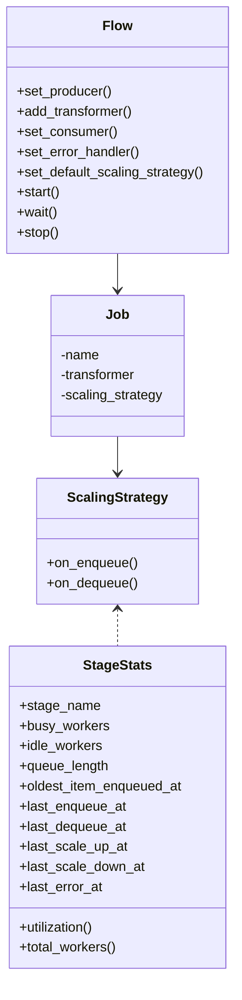
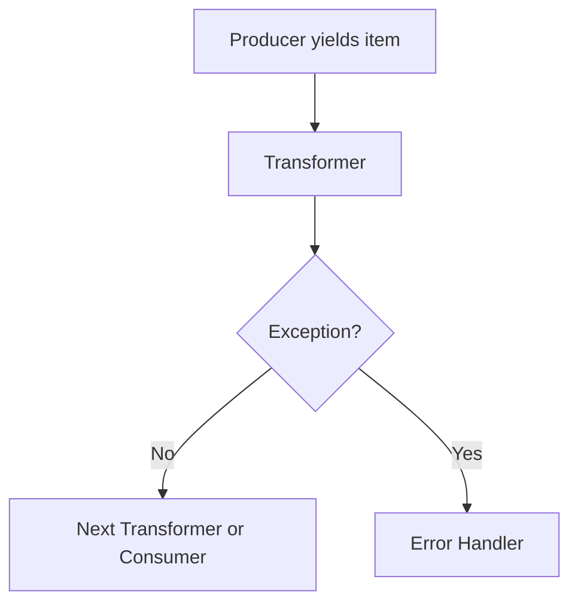

# flowrhythm

**Asynchronous, auto-scaling job pipeline for Python**

`flowrhythm` is a modern, asyncio-native framework for chaining async processing stages (jobs) in a pipeline, with robust error handling and configurable, strategy-based auto-scaling for each stage.

---

## 🚀 Features

- **Pipeline composition:** Connect async jobs with automatic wiring and resource management
- **Auto-scaling:** Adjustable per stage (job) or globally, with custom strategies
- **Error handling:** Exceptions route items to a dedicated error handler
- **Worker metrics:** Track busy, idle workers, queue length, and more
- **Async context managers:** Resource-safe transformers, consumers, and error handlers
- **Graceful shutdown:** Flows drain and close cleanly
- **Configurable sampling, cooldown, dampening:** Fine-tune scaling logic for advanced workloads

---

## 📦 Installation

```bash
pip install flowrhythm
```
_Not yet published. Use `pip install .` locally from source._

---

## 🏗️ Basic Concepts

### **Producer**
- An async generator (`async def`) that yields initial work items into the pipeline.

### **Transformer**
- An async function (`async def`) or async context manager that transforms each work item.

### **Consumer**
- An async function or async context manager that consumes final results (sink).

### **Error Handler**
- An async function or async context manager. Receives both the failed item and the exception.

### **Scaling Strategy**
- Decides how many worker tasks to run for each transformer stage, based on live stats.

---

## **Flow Interface**

```python
from flowrhythm import Flow, FixedScaling, UtilizationScaling

async def producer():
    for i in range(10):
        yield i

async def transformer(x):
    return x * 2

async def consumer(x):
    print("Got:", x)

async def error_handler(item, exc):
    print("Error:", item, exc)

flow = Flow(default_scaling_strategy=UtilizationScaling(max_workers=8))
flow.set_producer(producer)
flow.add_transformer(transformer, name="double", scaling_strategy=FixedScaling(workers=2))
flow.set_consumer(consumer)
flow.set_error_handler(error_handler)

# Run the flow
await flow.start()
await flow.wait()
```

- Each stage can be a simple function or an async context manager.
- **Scaling**: Per-transformer (job) or pipeline-wide.
- **Error handler**: Automatically receives any item that raises in a transformer.

---

## ⚙️ Scaling Strategies

### **FixedScaling**
- Keeps a constant number of workers for the stage.
```python
from flowrhythm import FixedScaling
flow.add_transformer(transformer, scaling_strategy=FixedScaling(workers=3))
```

### **UtilizationScaling**
- Dynamically adjusts workers based on stage utilization and queue stats.
  Supports advanced parameters like up/downscaling rate, cooldown, dampening, and sampling.
```python
from flowrhythm import UtilizationScaling
strategy = UtilizationScaling(
    min_workers=1,
    max_workers=8,
    lower_utilization=0.2,
    upper_utilization=0.8,
    upscaling_rate=2,
    downscaling_rate=1,
    cooldown_seconds=5.0,
    dampening=0.5,
    sampling_period=2.0,
    sampling_events=50,
)
flow.add_transformer(transformer, scaling_strategy=strategy)
```
- You can set a global default via `Flow(default_scaling_strategy=...)` or per stage.

---

## 🧯 Error Handling

- Any exception in a transformer sends the item (with exception object) to the error handler.
- The error handler can be a function or async context manager, and receives both the item and the actual Exception.

---

## 🧠 Concepts and API

### **Flow class**

| Method                  | Purpose                                                 |
|-------------------------|--------------------------------------------------------|
| `set_producer`          | Set async generator producing initial items            |
| `add_transformer`       | Add a stage (async fn or context manager)              |
| `set_consumer`          | Set sink (async fn or context manager)                 |
| `set_error_handler`     | Set async fn or context manager for errors             |
| `set_default_scaling_strategy` | Set pipeline-wide scaling default              |
| `start`, `wait`, `stop` | Control execution and lifecycle                        |

**Type signatures (stubs):**
```python
def add_transformer(
    self,
    transformer: Transformer,
    *,
    name: Optional[str] = None,
    scaling_strategy: Optional[ScalingStrategy] = None,
) -> None: ...
```
See [API Reference](#) for details.

---

## 📐 Class & Data Diagram



---

## 🔄 Flow Lifecycle



- Items flow from producer, through transformers, to consumer.
- Scaling logic is invoked on each enqueue and dequeue (optionally with sampling/cooldown).
- Error handler processes failed items.

---

## ⚠️ Advanced: Transformer & Consumer Resource Management

You can use async context managers for per-stage setup/teardown:

```python
from contextlib import asynccontextmanager

@asynccontextmanager
async def transformer_with_db():
    db = await connect_db()
    async def transform(x):
        return await db.process(x)
    yield transform
    await db.close()

flow.add_transformer(transformer_with_db)
```

---

## 📚 Extending & Customizing

- Implement your own scaling strategies by subclassing `ScalingStrategy` or using the provided protocol.
- Track more stats or add advanced features by extending the `StageStats` dataclass.

---

## 📄 License

MIT License. See `LICENSE`.

---

## 👤 Author

**Andrey Maximov**
[GitHub](https://github.com/yourusername)
