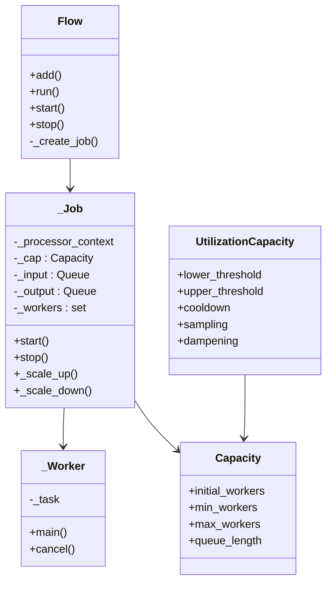
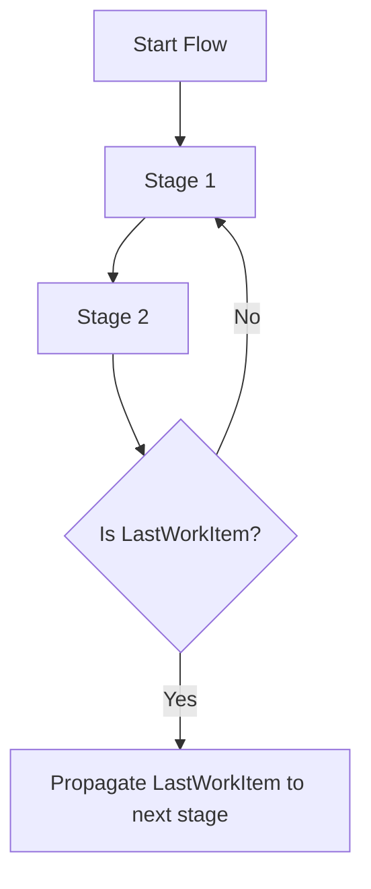

# `flowrhythm`

**Asynchronous Job Processing Framework with Auto-Scaling**

`flowrhythm` is a flexible, asyncio-based job pipeline framework. It chains jobs into flows, dynamically adjusts workers based on workload, and handles errors gracefully. It's designed for robust async processing with smart worker management.

---

## 🚀 Features

- 🔁 **Pipeline Composition** — Connect async jobs with automatic queue wiring
- 📈 **Auto Scaling** — Worker count adjusts using utilization thresholds
- ⚙️ **Custom Capacity** — Per-job settings for workers, queues, and scaling
- 🧯 **Error Handling** — Reroute failed jobs to a dedicated error job
- 📊 **Worker Metrics** — Tracks idle, active, and blocked workers
- ⏹️ **Graceful Shutdown** — End-of-work signaling with `LastWorkItem`

---

## 📦 Installation

```bash
pip install flowrhythm
```

_Not yet published. Use `pip install .` locally from source._

---

## 🔧 Example

```python
import asyncio
from flowrhythm import Flow, job_name, LastWorkItem

@job_name("Stage 1")
async def first_stage(item):
    print("Received:", item)
    return item + 1

@job_name("Stage 2")
async def second_stage(item):
    print("Processed:", item)
    if item >= 5:
        return LastWorkItem()
    return item + 1

async def main():
    flow = Flow()
    flow.add(first_stage)
    flow.add(second_stage)
    await flow.start()
    await flow._jobs[0]._input.put(0)
    await flow.run()

asyncio.run(main())
```

---

## 🧠 Concepts

### Flow

- Manages the lifecycle and execution of connected jobs
- Starts and stops all jobs
- Monitors when all workers are done

### Job

- Each job has:
  - Input/output queue
  - One or more workers
  - Context manager for startup/cleanup
- Auto-connected by `flow.add(...)`

### Capacity

Controls job scaling:

- `initial_workers`, `min_workers`, `max_workers`
- `queue_length`
- Utilization thresholds: `lower_threshold`, `upper_threshold`
- Timing: `cooldown`, `sampling`, `dampening`

### Error Job

Handles work rerouted due to:
- `RouteToErrorQueue`
- Unhandled exceptions in job processors

### LastWorkItem

- Signals end of input
- Triggers shutdown across job chain

---

## ⚙️ Decorators

- `@job_name(name)` — Human-readable job name
- `@job_capacity(capacity)` — Custom `Capacity` object
- `@workers(min, max, initial)` — Quick worker setup

---

## 📐 Class Diagram



---

## 🔄 Flow Lifecycle



Each job:
- Receives input from previous job
- Processes it
- Pushes result to next stage
- Scales workers based on utilization

---

## 📚 Strategy

Currently only one:

- `Strategy.UTILIZATION`: Dynamically scales workers based on how busy they are

---

## 🛠️ Exception Types

- `StopProcessing`: Skip this item, continue flow
- `RouteToErrorQueue`: Send item to error handler

---

## 📄 License

MIT License. See `LICENSE`.

---

## 👤 Author

**Andrey Maximov**  
[GitHub](https://github.com/yourusername)
