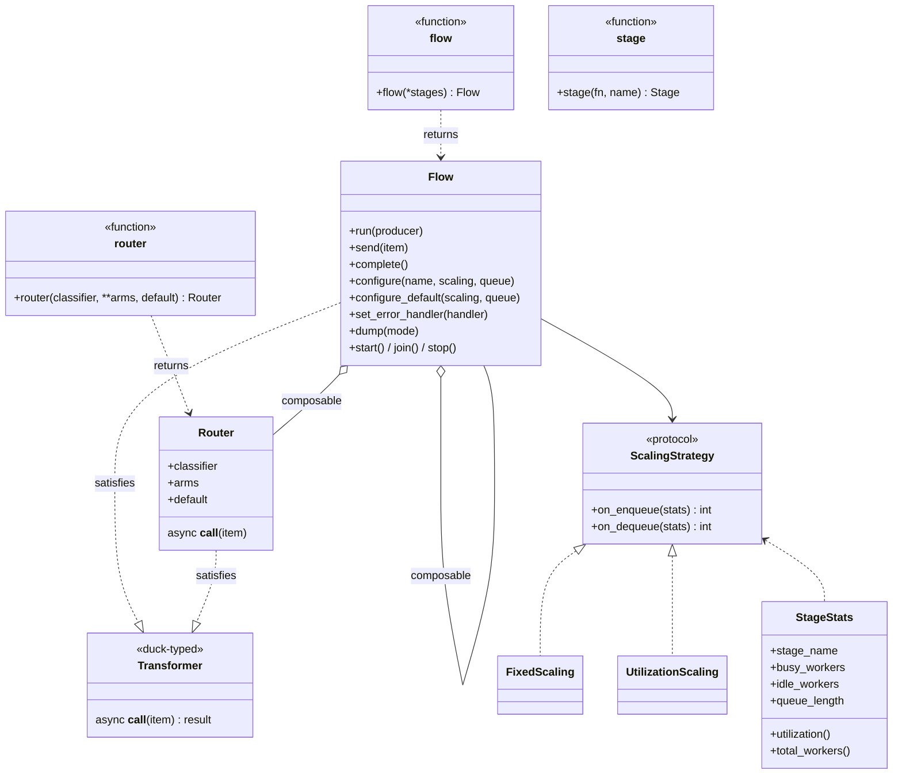
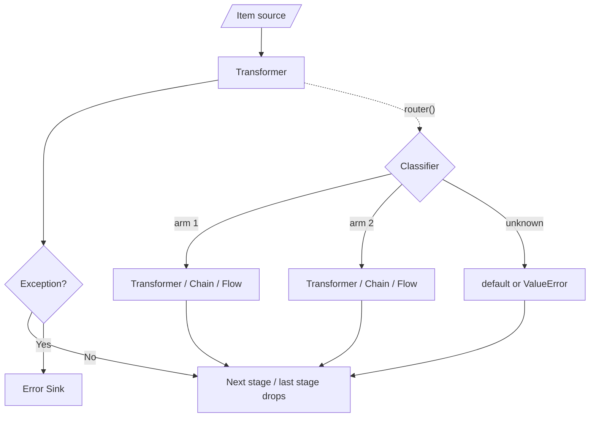

# flowrhythm

**Asynchronous, auto-scaling job pipeline for Python**

`flowrhythm` is an asyncio-native framework for stream processing pipelines. Define a pipeline as a sequence of plain async functions, then tune scaling and queues per stage at runtime.

> **Scope:** flowrhythm is built to **orchestrate external work** — spawning subprocesses, calling external services, driving I/O — not to run heavy computation inside Python. asyncio's concurrency model is unsuited to CPU-bound work; for that, hand off to a worker process, an external service, or a native binary, and let flowrhythm scale how many of those you keep busy.

---

## Installation

```bash
pip install flowrhythm
```
_Not yet published. Use `pip install .` locally from source._

---

## Quick Start

A flow defines the **processing chain**. The producer is supplied separately when you run it. This separation lets the same chain run against different sources (file, stream, push from web handler) without changing its definition.

```python
from flowrhythm import flow, router

# Producer — separate from the chain
async def reader():
    for i in range(100):
        yield i

# Chain stages — transformers and the final sink
async def normalize(x):       return x * 2
async def quick(x):           return x + 1
async def heavy(x):           return x ** 2
async def db_write(x):        print("stored:", x)
async def classify(x):        return "fast" if x < 50 else "slow"

# Define the chain
chain = flow(
    normalize,
    router(classify, fast=quick, slow=heavy),
    db_write,                     # last stage — implicit sink when run autonomously
)

# Drive it
await chain.run(reader)           # bounded — producer drives until exhausted
```

---

## Stages

A flow is a sequence of **transformers**. The producer is not part of the flow — it's supplied to `run()`. The last stage in the flow plays the **sink** role when run autonomously: its output is dropped. When the same flow is composed inside another flow as a sub-stage, the last stage's output is forwarded into the parent's downstream queue.

Roles are determined by **position and how the flow is driven**:
- Every stage in `flow()` is a transformer
- The last stage acts as a sink in autonomous mode (`run()`), or as the chain's output when composed
- Producers are passed to `run()`, never inside `flow()`

### What's inside a stage

Each stage owns:
- **Input queue** — items waiting to be processed (configurable: FIFO, LIFO, priority)
- **Worker pool** — N async tasks pulling from the input queue, processing items, pushing results into the **next stage's input queue**
- **Scaling strategy** — decides N based on live stats (queue length, worker utilization)

A queue lives **between** two stages. The downstream stage owns it. Configuring a queue (`flow.configure("normalize", queue=priority_queue)`) configures that stage's *input* queue — which is the upstream stage's destination.

```
                                    ┌─ stage owns input queue ─┐
                                    │                          │
                                    ▼                          ▼
   ┌──────────┐   queue1   ┌──────────────┐   queue2   ┌──────────────┐   queue3   ┌──────┐
   │ producer │ ─────────▶ │ transformer1 │ ─────────▶ │ transformer2 │ ─────────▶ │ sink │
   │ (1 wkr)  │            │   (N wkrs)   │            │   (M wkrs)   │            │(K wkr)│
   └──────────┘            └──────────────┘            └──────────────┘            └──────┘
                              │   │   │
                              ▼   ▼   ▼
                          scaling strategy
```

- 4 stages → 3 queues
- `queue1` is transformer1's input (and producer's destination)
- `queue2` is transformer2's input (and transformer1's destination)
- `queue3` is sink's input (and transformer2's destination)
- Producer has no input queue (generates items); sink has no output queue (terminal)

> **Async-only.** All stages must be async. Sync functions and sync context managers are rejected at construction. For sync code, wrap with `asyncio.to_thread` or use the `sync_stage()` helper (see [Public API](#public-api)).

### Producer (passed to `run()`)

The source of items. Not part of the chain definition — supplied as an argument to `run()`. **Always one worker (cannot scale).**

#### Why one worker?

A producer is an async generator. Async generators hold internal iteration state (where in the loop, last value yielded). They cannot be safely consumed by multiple workers:

- **Two workers calling the generator function** → each gets its own independent generator → both yield the *same* sequence → duplicates downstream.
- **Two workers sharing one generator instance** → race conditions on the iteration state → undefined behavior, lost or repeated items.

Either way, parallelism at the producer breaks pipeline correctness. So flowrhythm forces exactly one producer worker.

| Shape you write | When to use |
|---|---|
| `async def f():` ... `yield item` | Simple sources — file reader, range, in-memory queue |
| Factory returning `AsyncContextManager` whose `__aenter__` returns an async generator | Sources that need resource lifecycle (open connection, then stream) |

Examples:
```python
# Plain async generator
async def reader():
    for i in range(100):
        yield i

await chain.run(reader)

# CM factory — opens a resource, then streams from it
@asynccontextmanager
async def kafka_source():
    consumer = await connect_kafka()
    async def gen():
        async for msg in consumer:
            yield msg
    yield gen()
    await consumer.close()

await chain.run(kafka_source)
```

> **Producers do not go inside `flow(...)`.** Passing an async generator as a flow stage raises `TypeError`. They are sources and belong to `run()`.

#### What if I need parallel ingestion?

If your bottleneck is fetching items from an external source (Kafka with high throughput, paginated API with many pages, SQS poller), don't try to scale the producer — keep it minimal and put the parallelism in a **fetcher transformer**:

**Option 1: explicit producer + fetcher transformer**
```python
async def trigger():
    while True:
        yield None              # one signal per fetch attempt

async def fetch_message(_):
    return await kafka.poll()   # external state; safe to call from N workers

chain = flow(fetch_message, normalize, db_write)
chain.configure("fetch_message", scaling=UtilizationScaling(min_workers=4, max_workers=32))
await chain.run(trigger)
```

**Option 2: omit the producer; framework auto-emits None**
```python
chain = flow(fetch_message, normalize, db_write)
chain.configure("fetch_message", scaling=UtilizationScaling(min_workers=4, max_workers=32))
await chain.run()              # no producer arg → framework emits None forever
```

Same outcome, less boilerplate. Either way, the fetcher stage scales to as many workers as you need; each calls the external source independently.

### Transformer

A middle stage. Takes one item, returns one item. Multiple workers, auto-scaled (including scale-to-zero).

| Shape you write | When to use |
|---|---|
| `async def f(x) -> y` | Simple stateless processing — parse, transform, enrich |
| Factory `() -> AsyncContextManager` whose `__aenter__` returns an `async def fn(x) -> y` | Per-worker resource lifecycle — subprocess, DB connection, HTTP session |
| A `Flow` (from `flow(...)` without a sink) | Reuse a sub-pipeline as one stage |
| A `Router` (from `router(...)`) | Branching to one of several arms |

Examples:
```python
# Plain async function
async def normalize(x):
    return x.strip().lower()

# CM factory — per-worker DB connection
@asynccontextmanager
async def with_db():
    db = await connect_db()
    async def fn(x):
        return await db.process(x)
    yield fn
    await db.close()

# Class-based factory — instantiated per worker
class WithDB:
    async def __aenter__(self):
        self.db = await connect_db()
        async def fn(x):
            return await self.db.process(x)
        return fn
    async def __aexit__(self, *exc):
        await self.db.close()

# Sub-flow — composed
heavy_path = flow(decode, heavy)

# Router — branching
splitter = router(classify, fast=quick, slow=heavy_path)

chain = flow(normalize, with_db, splitter, db_write)
await chain.run(reader)
```

### Sink (implicit — last stage)

There is no separate "sink" type. The **last stage in `flow()` plays the sink role when run autonomously**: its return value is dropped, and it is what the items "land on."

```python
async def db_write(x):
    await db.insert(x)

chain = flow(normalize, db_write)    # db_write is the last stage → sink under run()
await chain.run(reader)              # reader's items → normalize → db_write (consumes)
```

The same chain composed inside another flow has no sink — its last stage's output flows into the parent's downstream queue:

```python
inner = flow(normalize, enrich)      # last stage = enrich
outer = flow(inner, db_write)        # inner is a transformer; enrich's output → db_write
await outer.run(reader)
```

Same `flow(normalize, enrich)` definition; sink behavior is determined by context, not declaration.

### How a worker invokes each shape

Knowing how the framework actually calls your code helps you reason about resources, lifecycle, and side effects.

In the pseudocode below, `my_queue` is the stage's own input queue and `next_queue` is the input queue of the downstream stage (or the producer's destination if this stage is upstream of the producer's first transformer).

#### Plain async function — `async def fn(x) -> y`

The worker holds a direct reference to your function. For each item, it `await`s the function:

```python
# Worker loop (simplified):
while running:
    item = await my_queue.get()
    result = await fn(item)
    await next_queue.put(result)
```

No setup, no teardown. Function is called once per item. If you need per-worker state (a counter, a buffer), use the CM factory shape instead — closures over function locals don't survive across calls.

#### CM factory — `() -> AsyncContextManager[Callable]`

When the worker starts, it calls your factory **once** and enters the context. The yielded callable becomes the per-item function for the rest of the worker's life:

```python
# Worker loop (simplified):
async with factory() as fn:        # __aenter__ — acquire resource (once)
    while running:
        item = await my_queue.get()
        result = await fn(item)    # use the resource
        await next_queue.put(result)
# __aexit__ — release resource (once, on shutdown)
```

This is how you bind per-worker state — anything you set up before `yield fn` lives for the worker's lifetime, anything captured by `fn`'s closure is per-worker.

You **pass the factory**, not a built CM:

```python
flow(with_db, db_write)              # ✓ pass the factory
flow(with_db(), db_write)            # ✗ pass a built CM (only enterable once)
```

Both `@asynccontextmanager`-decorated functions and classes implementing `__aenter__`/`__aexit__` (with a no-arg constructor) satisfy the factory shape.

#### Sub-flow — `Flow`

The worker treats the sub-flow as a nested pipeline. The sub-flow has its own internal queues and workers, isolated from the parent. Each item entering the sub-flow goes through its full chain before the result is forwarded to the parent's next queue:

```python
# Worker loop (simplified):
while running:
    item = await my_queue.get()
    result = await sub_flow.process(item)   # runs the sub-flow's chain
    await next_queue.put(result)
```

Sub-flows are introspectable for `dump()` — the parent flow knows it contains a sub-flow and can show the nested structure.

#### Router — `Router`

The worker calls the classifier, looks up the matching arm, and invokes it. The arm itself is a Transformer of any shape — so router dispatching can recurse into sub-flows, CM factories, plain functions, even nested routers:

```python
# Worker loop (simplified):
while running:
    item = await my_queue.get()
    label = await router.classifier(item)
    arm = router.arms.get(label, router.default)
    if arm is None:
        raise ValueError(f"unknown arm {label!r}")
    result = await invoke(arm, item)        # dispatch to the right shape
    await next_queue.put(result)
```

Routers are flat — whichever arm runs, its result is what the router emits. No separate "branch then merge" — the router writes directly into the next queue.

### Worker lifecycle and scaling

Workers come and go based on the scaling strategy:

| Event | Plain async fn | CM factory |
|---|---|---|
| Worker spawned (scale up) | Reference captured | `factory()` called → `__aenter__` runs → resource acquired |
| Worker processes item | `await fn(item)` | `await fn(item)` (using resource from `__aenter__`) |
| Worker stopped (scale down) | Coroutine cancelled | `__aexit__` runs → resource released |
| Stage scales 0 → 1 | First worker spawned, processes pending items | First worker spawned, factory called, resource acquired (latency on first item) |
| Stage scales N → 0 | All workers cancelled | All `__aexit__` run; all resources released |

### Router

A `Router` (returned by `router()`) is a Transformer that dispatches items to one of several arms based on a classifier:

```python
router(classifier, **arms, default=None)
```

- `classifier` — `async def (item) -> label`
- `**arms` — keyword args mapping label → Transformer (any of the shapes above)
- `default` — optional fallback Transformer for unmatched labels

If the classifier returns a label not in `arms` and `default` is `None`, `ValueError` is raised.

### Error Handler

Pipeline-level. Receives `(item, exception)` for anything uncaught in a transformer. One per flow. Terminal — does not return items into the pipeline.

```python
async def on_error(item, exc):
    logger.error("dropped %s: %s", item, exc)
```

### Scaling Strategy

Decides how many workers a stage runs based on live `StageStats`. Built-in: `FixedScaling`, `UtilizationScaling`. Or implement the protocol yourself.

---

## Designing a flow

A flow is **pure structure** — the chain of transformers. The producer is supplied at run time. Configuration (scaling, queues) is separate.

### Linear

```python
chain = flow(normalize, db_write)
await chain.run(reader)
```

### Reusable as a transformer

Any flow can be used as a stage inside another flow. Its last stage's output is forwarded to the parent's downstream queue:

```python
heavy_path = flow(decode, heavy, enrich)

main = flow(
    normalize,
    heavy_path,         # plugged in as a stage
    db_write,
)
await main.run(reader)
```

### Routing

`router(classifier, **arms, default=...)` dispatches by label. Each arm can be any Transformer — function, chain, or full flow:

```python
heavy_path = flow(decode, heavy)

main = flow(
    normalize,
    router(classify,
        fast=quick,             # plain async function
        slow=heavy_path,        # transform chain
        default=passthrough,    # optional fallback
    ),
    db_write,
)
await main.run(reader)
```

If the classifier returns a label that has no arm and no `default` is set, `ValueError` is raised.

### Composing flows

A flow can be used as a transformer in another flow. The producer is passed only to the outermost `run()`:

```python
ingest = flow(parse, validate)

main = flow(
    ingest,             # plug in as a stage
    db_write,
)
await main.run(event_source)
```

### Naming

Stage names are auto-derived from function names. Collisions get a numeric suffix:

```python
chain = flow(normalize, normalize, db_write)
# stage names: "normalize", "normalize_2", "db_write"
```

Override when needed:

```python
from flowrhythm import stage

main = flow(
    reader,
    stage(normalize, name="parse"),
    db_write,
)
```

---

## Configuring a flow

Configuration is operational — it tunes how the flow runs without changing what it does.

```python
from flowrhythm import flow, FixedScaling, UtilizationScaling, lifo_queue, priority_queue

chain = flow(normalize, db_write)

# Per-stage tuning
chain.configure("normalize", scaling=UtilizationScaling(max_workers=8))
chain.configure("priority_stage", queue=priority_queue)

# Pipeline-wide defaults
chain.configure_default(scaling=FixedScaling(workers=2))

# Error sink (last resort for uncaught exceptions in transformers)
chain.set_error_handler(on_error)

await chain.run(reader)
```

The same chain definition can be configured differently per environment, and driven by different producers:

```python
def build():
    return flow(normalize, db_write)

dev = build()
dev.configure_default(scaling=FixedScaling(workers=1))
await dev.run(test_source)              # batch from a small fixture

prod = build()
prod.configure("normalize", scaling=UtilizationScaling(max_workers=32))
await prod.run(kafka_source)            # stream from production
```

---

## Scaling Strategies

### FixedScaling
Constant worker count. Requires `workers >= 1` (use `UtilizationScaling` for scale-to-zero).
```python
FixedScaling(workers=4)
```

### UtilizationScaling
Adjusts worker count based on busy/idle ratio. Supports scale-to-zero via `min_workers=0`.
```python
UtilizationScaling(
    min_workers=0,          # scale-to-zero allowed
    max_workers=8,
    lower_utilization=0.2,
    upper_utilization=0.8,
    upscaling_rate=2,
    downscaling_rate=1,
    cooldown_seconds=5.0,
    dampening=0.5,
    sampling_period=2.0,
    sampling_events=50,
)
```

### Custom strategy
Implement the protocol:
```python
class MyStrategy:
    async def on_enqueue(self, stats: StageStats) -> int: ...
    async def on_dequeue(self, stats: StageStats) -> int: ...
```
Return positive to add workers, negative to remove, `0` for no change.

### Worker rules
- **Producer** always runs exactly one worker (cannot scale; passed to `run()`)
- **Transformers and the last stage** can scale, including down to zero
- A worker holds its async context manager for its lifetime; releasing happens on shutdown
- First item after `0→1` transition pays the resource-acquire cost

---

## Error Handling

Two layers, in order:

1. **Inside the transformer** (preferred). Catch and handle: log, retry, return a sentinel, drop.
2. **Pipeline error sink** (last resort). Anything uncaught in a transformer is routed here.

```python
async def on_error(item, exc):
    logger.error("dropped %s: %s", item, exc)

chain = flow(normalize, db_write)
chain.set_error_handler(on_error)
await chain.run(reader)
```

The error sink is terminal — it does not return items back into the pipeline.

---

## Driving a flow

A `Flow` is symmetric — only how you drive it differs. Three modes, all on the same instance.

### Bounded autonomous (`run(producer)`)

You provide an async generator. The framework iterates it, terminates when it's exhausted.

```python
async def reader():
    for i in range(100):
        yield i

chain = flow(normalize, db_write)
await chain.run(reader)
# → reader exhausts → pipeline drains → returns
```

### Unbounded autonomous (`run()`)

No producer. The framework emits `None` signals indefinitely until you call `stop()`. The first transformer is responsible for fetching the actual data:

```python
async def fetch(_):
    return await kafka.next()

chain = flow(fetch, normalize, db_write)
asyncio.create_task(chain.run())
# ... later
await chain.stop()
```

### Push (`async with` + `send`)

You drive the flow by calling `send(item)`. Useful for embedding flowrhythm into a web server, WebSocket handler, or any event-driven context.

```python
chain = flow(normalize, db_write)

async with chain:
    await chain.send(item1)
    await chain.send(item2)
# on exit: framework completes the flow and waits for it to drain
```

`send()` blocks if the downstream queue is full (natural backpressure).

### Mode rules

The first call **locks the mode** for that flow instance:
- `run()` raises if the flow is already inside `async with` (push mode)
- `send()` raises if the flow is being driven by `run()`
- `stop()` is always available

### Manual control

For finer-grained control you can use the lower-level lifecycle methods directly:

```python
chain = flow(normalize, db_write)
await chain.start()           # spawn workers, return immediately
# ... drive items somehow (run/send/external)
await chain.complete()        # signal "no more items"
await chain.join()            # wait until all items drain
await chain.stop()            # abort: cancel workers, no draining
```

---

## Public API

### Construction

| Symbol | Kind | Purpose |
|---|---|---|
| `flow(*stages)` | function | Construct a flow from a sequence of transformers (no producer) |
| `router(classifier, **arms, default=...)` | function | Construct a router for branching |
| `stage(fn, name=...)` | function | Override the auto-derived name of a stage |
| `sync_stage(fn)` *(planned)* | function | Wrap a sync function with `asyncio.to_thread` so it can be used as an async stage |

### Driving a flow (Flow methods)

| Method | Purpose |
|---|---|
| `flow.run(producer=None)` | Run autonomously. With a producer: bounded; without: unbounded auto-trigger |
| `flow.send(item)` | Push an item into the flow (only valid inside `async with`) |
| `flow.complete()` | Signal end-of-stream in push mode (called automatically on `async with` exit) |
| `flow.start()` | Low-level: spawn workers, return immediately |
| `flow.join()` | Low-level: wait until all items drain |
| `flow.stop()` | Abort: cancel workers without draining |
| `flow.configure(name, scaling=..., queue=...)` | Per-stage tuning |
| `flow.configure_default(scaling=..., queue=...)` | Pipeline-wide defaults |
| `flow.set_error_handler(handler)` | Set the error sink for uncaught transformer exceptions |
| `flow.dump(mode="structure" \| "stats")` | Inspect the flow — graph layout or live runtime stats |

### Types and helpers

| Symbol | Kind | Purpose |
|---|---|---|
| `Flow` | class | Type hint only — `def helper(f: Flow) -> Flow`. Construct via `flow()`. |
| `Router` | class | Type hint only — produced by `router()` |
| `FixedScaling`, `UtilizationScaling` | classes | Built-in scaling strategies |
| `ScalingStrategy`, `StageStats` | protocol / dataclass | For implementing custom strategies |
| `fifo_queue`, `lifo_queue`, `priority_queue` | functions | Queue factories |

---

## Architecture

### Design Principles

- **Orchestrator, not a worker.** flowrhythm coordinates external heavy work (subprocesses, services, I/O). It is not for running CPU-bound computation inside the Python process.
- **Stream processing pipeline, not a workflow engine.** The graph is a DAG — no cycles. Items flow forward and terminate at a sink.
- **Structure and configuration are separate.** `flow()` defines what flows where. `.configure()` tunes how it runs.
- **Composable.** A flow plugs into another flow as a transformer. Complex topologies are built by composition, not by complicating the DSL.
- **Routing via `router()`.** Branching is a regular transformer that dispatches to sub-pipelines by label. Arms converge after the router.
- **Retry/iteration belongs inside a stage**, not in the graph topology.

### Component Overview


```mermaid
classDiagram
    class flow {
        <<function>>
        +flow(*stages) Flow
    }

    class router {
        <<function>>
        +router(classifier, **arms, default) Router
    }

    class stage {
        <<function>>
        +stage(fn, name) Stage
    }

    class Transformer {
        <<duck-typed>>
        async __call__(item) result
    }

    class Flow {
        +run(producer)
        +send(item)
        +complete()
        +configure(name, scaling, queue)
        +configure_default(scaling, queue)
        +set_error_handler(handler)
        +dump(mode)
        +start() / join() / stop()
    }

    class Router {
        +classifier
        +arms
        +default
        async __call__(item)
    }

    class ScalingStrategy {
        <<protocol>>
        +on_enqueue(stats) int
        +on_dequeue(stats) int
    }
    class FixedScaling
    class UtilizationScaling

    class StageStats {
        +stage_name
        +busy_workers
        +idle_workers
        +queue_length
        +utilization()
        +total_workers()
    }

    flow ..> Flow : returns
    router ..> Router : returns
    Flow ..|> Transformer : satisfies
    Router ..|> Transformer : satisfies
    Flow o-- Flow : composable
    Flow o-- Router : composable
    Flow --> ScalingStrategy
    ScalingStrategy <|.. FixedScaling
    ScalingStrategy <|.. UtilizationScaling
    ScalingStrategy <.. StageStats
```

### Transformer kinds

The framework discriminates four concrete forms when running a stage:

```python
match stage:
    case Flow() as sub_flow:
        # introspect for dump(); run as nested pipeline
    case Router() as r:
        # dispatch to arms by classifier
    case ctx if isinstance(ctx, AsyncContextManager):
        # acquire on worker start, release on worker stop
    case fn:
        # plain async callable
```

### Pipeline Flow


```mermaid
flowchart TD
    Src[/Item source/] --> B[Transformer]
    B --> C{Exception?}
    C -- No --> D[Next stage / last stage drops]
    C -- Yes --> E[Error Sink]
    B -. "router()" .-> F{Classifier}
    F -- arm 1 --> G[Transformer / Chain / Flow]
    F -- arm 2 --> H[Transformer / Chain / Flow]
    F -- unknown --> I[default or ValueError]
    G --> D
    H --> D
    I --> D
```

Item source is one of:
- A producer passed to `run(producer)` — bounded
- Auto-emitted `None` signals from `run()` — unbounded
- Items pushed via `send()` inside `async with` — push mode

---

## License

MIT License. See `LICENSE`.

---

## Author

**Andrey Maximov**
[GitHub](https://github.com/maxsimov)

[](https://codecov.io/github/maxsimov/flowrhythm)
