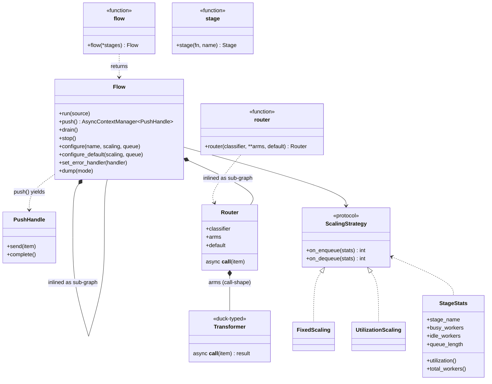
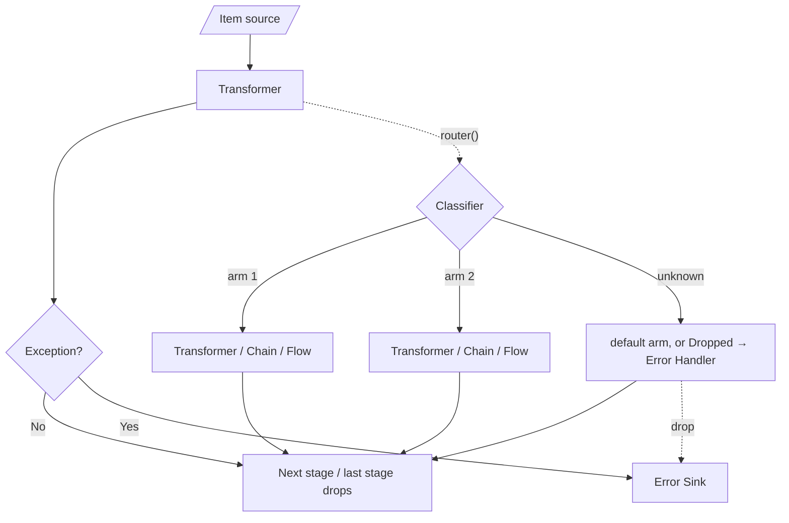

# flowrhythm

**Asynchronous, auto-scaling job pipeline for Python**

`flowrhythm` is an asyncio-native framework for stream processing pipelines. Define a pipeline as a sequence of plain async functions, then tune scaling and queues per stage at runtime.

> **Scope:** flowrhythm is built to **orchestrate external work** — spawning subprocesses, calling external services, driving I/O — not to run heavy computation inside Python. asyncio's concurrency model is unsuited to CPU-bound work; for that, hand off to a worker process, an external service, or a native binary, and let flowrhythm scale how many of those you keep busy.

---

## Contents

- [Installation](#installation)
- [Quick Start](#quick-start)
- [Stages](#stages) — what's inside a stage, the four transformer shapes, how each is invoked
- [Designing a flow](#designing-a-flow) — linear, reusable chains, routing, sub-flow composition, naming
- [Configuring a flow](#configuring-a-flow) — per-stage scaling, queues, error handler
- [Scaling Strategies](#scaling-strategies) — `FixedScaling`, `UtilizationScaling`, custom
- [Error Handling](#error-handling) — typed events, handler-decides-policy
- [Driving a flow](#driving-a-flow) — `run`, `push`, `drain`, `stop`; bounded vs unbounded vs push
- [Public API](#public-api) — full method and type reference
- [Guarantees](#guarantees) — what the framework promises, and what it doesn't
- [Architecture](#architecture) — design principles, component overview, pipeline flow

---

## Installation

```bash
pip install flowrhythm
```
_Not yet published. Use `pip install .` locally from source._

---

## Quick Start

A `flow` is a chain of async stages. The last stage consumes (the "sink"). You activate the chain in one of several ways — passing a source generator to `run()`, pushing items in via `push()`, or letting the framework drive it. See [Driving a flow](#driving-a-flow) for all options.

```python
from flowrhythm import flow, router

# Stages — transformers and the final sink
async def normalize(x):       return x * 2
async def quick(x):           return x + 1
async def heavy(x):           return x ** 2
async def db_write(x):        print("stored:", x)
async def classify(x):        return "fast" if x < 50 else "slow"

# Define the chain
chain = flow(
    normalize,
    router(classify, fast=quick, slow=heavy),
    db_write,
)

# Activate it — here, by feeding a source of items
async def items():
    for i in range(100):
        yield i

await chain.run(items)
```

---

## Stages

A flow is a sequence of **stages**. Items enter at the first stage's input queue, flow through each stage, and the last stage consumes them (the **sink**). Where items come from is decided when you activate the flow — see [Driving a flow](#driving-a-flow).

### What's inside a stage

Each stage owns:
- **Input queue** — items waiting to be processed (configurable: FIFO, LIFO, priority)
- **Worker pool** — N async tasks pulling from the input queue, processing items, pushing results into the **next stage's input queue**
- **Scaling strategy** — decides N based on live stats (queue length, worker utilization)

A queue lives **between** two stages. The downstream stage owns it. Configuring a queue (`flow.configure("normalize", queue=priority_queue)`) configures that stage's *input* queue — which is the upstream stage's destination.

```
                                    ┌─ stage owns input queue ─┐
                                    │                          │
                                    ▼                          ▼
   ┌──────────────┐   queue1   ┌──────────────┐   queue2   ┌──────────────┐   queue3   ┌──────┐
   │ item source  │ ─────────▶ │ transformer1 │ ─────────▶ │ transformer2 │ ─────────▶ │ sink │
   │ (external)   │            │   (N wkrs)   │            │   (M wkrs)   │            │(K wkr)│
   └──────────────┘            └──────────────┘            └──────────────┘            └──────┘
                                  │   │   │
                                  ▼   ▼   ▼
                              scaling strategy
```

- 3 stages → 3 queues (one fronts each stage; the source feeds queue1)
- `queue1` is transformer1's input (and the item source's destination)
- `queue3` is sink's input (and transformer2's destination)
- Sink has no output queue — items terminate there

The **item source** is external to the flow. It's whatever drives items into queue1 — see [Driving a flow](#driving-a-flow).

> **Async-only.** All stages must be async. Sync functions and sync context managers are rejected at construction. For sync code, wrap with `asyncio.to_thread` or use the `sync_stage()` helper (see [Public API](#public-api)).

### Transformer

A middle stage. Multiple workers, auto-scaled (including scale-to-zero).

There are two **call-shape transformers** (single-stage units the framework invokes per item):

| Shape you write | When to use |
|---|---|
| `async def f(x) -> y` | Simple stateless processing — parse, transform, enrich |
| Factory `() -> AsyncContextManager` whose `__aenter__` returns an `async def fn(x) -> y` | Per-worker resource lifecycle — subprocess, DB connection, HTTP session |

And two **graph fragments** (multi-stage units that get inlined into the parent's pipeline graph):

| Shape you write | What happens |
|---|---|
| A `Flow` (from `flow(...)`) | Sub-flow's stages are stitched into the parent's graph; each keeps its own queue + workers + scaling |
| A `Router` (from `router(...)`) | Each arm becomes a sub-graph; classifier dispatches items to the chosen arm's input queue |

Examples:
```python
# Plain async function
async def normalize(x):
    return x.strip().lower()

# CM factory — per-worker DB connection
@asynccontextmanager
async def with_db():
    db = await connect_db()
    async def fn(x):
        return await db.process(x)
    yield fn
    await db.close()

# Class-based factory — instantiated per worker
class WithDB:
    async def __aenter__(self):
        self.db = await connect_db()
        async def fn(x):
            return await self.db.process(x)
        return fn
    async def __aexit__(self, *exc):
        await self.db.close()

# Sub-flow — graph fragment, gets inlined when composed
heavy_path = flow(decode, heavy)
heavy_path.configure("decode", scaling=UtilizationScaling(min_workers=2, max_workers=8))

# Router — graph fragment with branching arms
splitter = router(classify, fast=quick, slow=heavy_path)

chain = flow(normalize, with_db, splitter, db_write)
await chain.run(reader)
```

> **Sub-flows are not function calls.** When you put a `Flow` into another `flow(...)`, its internal stages are *inlined* into the outer pipeline graph — they keep their own queues, workers, and scaling. The same sub-flow definition behaves identically whether run standalone (`await heavy_path.run(producer)`) or composed. See [Composing flows](#composing-flows).

### Sink (implicit — last stage)

There is no separate "sink" type. The **last stage in `flow()` plays the sink role when run autonomously**: its return value is dropped, and it is what the items "land on."

```python
async def db_write(x):
    await db.insert(x)

chain = flow(normalize, db_write)    # db_write is the last stage → sink under run()
await chain.run(reader)              # reader's items → normalize → db_write (consumes)
```

The same chain composed inside another flow has no sink — its last stage's output flows into the parent's downstream queue:

```python
inner = flow(normalize, enrich)      # last stage = enrich
outer = flow(inner, db_write)        # inner is a transformer; enrich's output → db_write
await outer.run(reader)
```

Same `flow(normalize, enrich)` definition; sink behavior is determined by context, not declaration.

### How a worker invokes each shape

Knowing how the framework actually calls your code helps you reason about resources, lifecycle, and side effects.

In the pseudocode below, `my_queue` is the stage's own input queue and `next_queue` is the input queue of the downstream stage.

#### Plain async function — `async def fn(x) -> y`

The worker holds a direct reference to your function. For each item, it `await`s the function:

```python
# Worker loop (simplified):
while running:
    item = await my_queue.get()
    result = await fn(item)
    await next_queue.put(result)
```

No setup, no teardown. Function is called once per item. If you need per-worker state (a counter, a buffer), use the CM factory shape instead — closures over function locals don't survive across calls.

#### CM factory — `() -> AsyncContextManager[Callable]`

When the worker starts, it calls your factory **once** and enters the context. The yielded callable becomes the per-item function for the rest of the worker's life:

```python
# Worker loop (simplified):
async with factory() as fn:        # __aenter__ — acquire resource (once)
    while running:
        item = await my_queue.get()
        result = await fn(item)    # use the resource
        await next_queue.put(result)
# __aexit__ — release resource (once, on shutdown)
```

This is how you bind per-worker state — anything you set up before `yield fn` lives for the worker's lifetime, anything captured by `fn`'s closure is per-worker.

You **pass the factory**, not a built CM:

```python
flow(with_db, db_write)              # ✓ pass the factory
flow(with_db(), db_write)            # ✗ pass a built CM (only enterable once)
```

Both `@asynccontextmanager`-decorated functions and classes implementing `__aenter__`/`__aexit__` (with a no-arg constructor) satisfy the factory shape.

#### Sub-flow — `Flow` (graph fragment, not a call)

Sub-flows are **not invoked** by a parent worker. When you place a `Flow` in another `flow(...)`, the framework expands it into the parent's pipeline graph at construction time. Each sub-stage keeps its own queue and worker pool.

For example:
```python
inner = flow(decode, validate)
inner.configure("decode", scaling=UtilizationScaling(min_workers=1, max_workers=8))

outer = flow(parse, inner, sink)
```

The effective graph that runs is:

```
parse → [queue] → inner.decode → [queue] → inner.validate → [queue] → sink
```

Four stages, three queues. `inner.decode` has its own 1–8 worker pool exactly as `inner.configure` specified. The `parse` worker pushes its output into `inner.decode`'s input queue and moves on — no awaiting a result. Items flow through `inner` autonomously and arrive at `sink`'s input queue.

**Sub-flow stages are namespaced** in the parent: `inner.decode`, `inner.validate`. You can override config from the parent:
```python
outer.configure("inner.decode", scaling=FixedScaling(workers=4))
```

The same `inner` definition runs identically standalone (`await inner.run(producer)`) or composed inside `outer`. Composition does not change behavior.

#### Router — `Router` (graph fragment with branching)

Like sub-flows, routers are graph fragments — each arm becomes its own sub-graph in the parent pipeline. The router has one input queue (the classifier reads from it), and dispatches items to whichever arm's input queue matches the classification.

```python
heavy_path = flow(decode, heavy)
splitter = router(classify, fast=quick, slow=heavy_path)

main = flow(parse, splitter, sink)
```

Effective graph:
```
                              ┌─ quick ──────────────────────────┐
parse → [q] → splitter ─►─ ──┤                                  ├──► [q] → sink
                              └─ heavy_path.decode → heavy_path.heavy ─┘
```

Each arm has its own queue and worker pool. Outputs of all arms feed the same downstream queue (the stage after the router). Sub-flow arms are inlined the same way as sub-flow stages elsewhere.

The router stage itself runs the classifier:
```python
# Router worker loop (simplified):
while running:
    item = await my_queue.get()
    label = await router.classifier(item)
    target_queue = router.arm_queues.get(label, router.default_queue)
    if target_queue is None:
        # No matching arm and no default → reported to the error handler
        # as Dropped(item, stage, reason=DropReason.ROUTER_MISS); item is dropped.
        emit_dropped(item, reason=ROUTER_MISS)
        continue
    await target_queue.put(item)
```

### Worker lifecycle and scaling

Workers come and go based on the scaling strategy:

| Event | Plain async fn | CM factory |
|---|---|---|
| Worker spawned (scale up) | Reference captured | `factory()` called → `__aenter__` runs → resource acquired |
| Worker processes item | `await fn(item)` | `await fn(item)` (using resource from `__aenter__`) |
| Worker stopped (scale down) | Coroutine cancelled | `__aexit__` runs → resource released |
| Stage scales 0 → 1 | First worker spawned, processes pending items | First worker spawned, factory called, resource acquired (latency on first item) |
| Stage scales N → 0 | All workers cancelled | All `__aexit__` run; all resources released |

### Router

A `Router` (returned by `router()`) is a Transformer that dispatches items to one of several arms based on a classifier:

```python
router(classifier, **arms, default=None)
```

- `classifier` — `async def (item) -> label`
- `**arms` — keyword args mapping label → Transformer (any of the shapes above)
- `default` — optional fallback Transformer for unmatched labels

If the classifier returns a label not in `arms` and `default` is `None`, the item is dropped and the error handler receives a `Dropped(..., reason=DropReason.ROUTER_MISS)` event. The pipeline continues by default; raise from the handler to abort.

### Error Handler

Pipeline-level. Receives **typed events** describing failures and drops. One per flow. See [Error Handling](#error-handling) for the full set of event types and behavior.

```python
from flowrhythm import TransformerError, SourceError, Dropped

async def on_error(event):
    match event:
        case TransformerError(item, exc, stage):
            log.error("stage %s failed on %r: %s", stage, item, exc)
        case SourceError(exc):
            log.critical("source failed: %s", exc); raise
        case Dropped(item, stage, reason):
            log.warn("dropped %r at %s: %s", item, stage, reason.name)
```

### Scaling Strategy

Decides how many workers a stage runs based on live `StageStats`. Built-in: `FixedScaling`, `UtilizationScaling`. Or implement the protocol yourself.

---

## Designing a flow

A flow is **pure structure** — the chain of stages. How items get fed in is decided at activation time (`run()` or `push()`). Configuration (scaling, queues) is separate from both structure and activation.

### Linear

```python
chain = flow(normalize, db_write)
await chain.run(reader)
```

### Reusable as a transformer

Any flow can be used as a stage inside another flow. Its last stage's output is forwarded to the parent's downstream queue:

```python
heavy_path = flow(decode, heavy, enrich)

main = flow(
    normalize,
    heavy_path,         # plugged in as a stage
    db_write,
)
await main.run(reader)
```

### Routing

`router(classifier, **arms, default=...)` dispatches by label. Each arm can be any Transformer — function, chain, or full flow:

```python
heavy_path = flow(decode, heavy)

main = flow(
    normalize,
    router(classify,
        fast=quick,             # plain async function
        slow=heavy_path,        # transform chain
        default=passthrough,    # optional fallback
    ),
    db_write,
)
await main.run(reader)
```

If the classifier returns a label that has no arm and no `default` is set, the item is **dropped** and the error handler receives a `Dropped(item, stage, reason=DropReason.ROUTER_MISS)` event. The pipeline continues running. See [Error Handling](#error-handling) if you want to abort on router misses (raise from your handler).

### Composing flows

A flow can be embedded as a stage in another flow. The framework **expands the sub-flow's stages into the parent's pipeline graph** at construction. Each sub-stage retains its own queue, worker pool, scaling, and config. Activation (`run`, `send`) only happens on the outermost flow.

```python
ingest = flow(parse, validate)
ingest.configure("validate", scaling=UtilizationScaling(max_workers=8))

main = flow(
    ingest,             # graph-inlined into main
    db_write,
)
await main.run(event_source)

# Effective graph at runtime:
#   item source → ingest.parse → ingest.validate → db_write
#
# ingest.validate keeps its 1–8 worker scaling.
```

The same `ingest` definition runs identically standalone:
```python
await ingest.run(event_source)   # produces output via its last stage (validate)
```

Override sub-flow config from the parent if needed:
```python
main.configure("ingest.parse", scaling=FixedScaling(workers=2))
```

### Naming

Stage names are auto-derived from function names. Collisions get a numeric suffix:

```python
chain = flow(normalize, normalize, db_write)
# stage names: "normalize", "normalize_2", "db_write"
```

Override when needed:

```python
from flowrhythm import stage

main = flow(
    reader,
    stage(normalize, name="parse"),
    db_write,
)
```

---

## Configuring a flow

Configuration is operational — it tunes how the flow runs without changing what it does.

```python
from flowrhythm import flow, FixedScaling, UtilizationScaling, lifo_queue, priority_queue

chain = flow(normalize, db_write)

# Per-stage tuning
chain.configure("normalize", scaling=UtilizationScaling(max_workers=8))
chain.configure("priority_stage", queue=priority_queue)

# Pipeline-wide defaults
chain.configure_default(scaling=FixedScaling(workers=2))

# Error sink (last resort for uncaught exceptions in transformers)
chain.set_error_handler(on_error)

await chain.run(reader)
```

The same chain definition can be configured differently per environment, and activated against different sources:

```python
def build():
    return flow(normalize, db_write)

dev = build()
dev.configure_default(scaling=FixedScaling(workers=1))
await dev.run(test_source)              # batch from a small fixture

prod = build()
prod.configure("normalize", scaling=UtilizationScaling(max_workers=32))
await prod.run(kafka_source)            # stream from production
```

---

## Scaling Strategies

### FixedScaling
Constant worker count. Requires `workers >= 1` (use `UtilizationScaling` for scale-to-zero).
```python
FixedScaling(workers=4)
```

### UtilizationScaling
Adjusts worker count based on busy/idle ratio. Supports scale-to-zero via `min_workers=0`.
```python
UtilizationScaling(
    min_workers=0,          # scale-to-zero allowed
    max_workers=8,
    lower_utilization=0.2,
    upper_utilization=0.8,
    upscaling_rate=2,
    downscaling_rate=1,
    cooldown_seconds=5.0,
    dampening=0.5,
    sampling_period=2.0,
    sampling_events=50,
)
```

### Custom strategy
Implement the protocol:
```python
class MyStrategy:
    async def on_enqueue(self, stats: StageStats) -> int: ...
    async def on_dequeue(self, stats: StageStats) -> int: ...
```
Return positive to add workers, negative to remove, `0` for no change.

### Worker rules
- **The source iterator** (when you pass a producer to `run()`) is consumed by exactly one task — async generators cannot be safely consumed concurrently
- **All stages in the chain** can scale, including down to zero
- A worker holds its async context manager for its lifetime; releasing happens on shutdown
- First item after `0→1` transition pays the resource-acquire cost

---

## Error Handling

Errors and drops are reported to a single pipeline-level **error handler** as **typed events**. The handler decides what to do with each event by what it does with it:

- **Returns normally** → pipeline continues
- **Raises** → pipeline aborts, exception propagates out of `run()`

Two layers, in order:

1. **Inside the transformer** (preferred). Catch and handle there: retry, return a sentinel value, drop silently. Most error logic should live here because the transformer has full context.
2. **Pipeline error handler** (last resort). Whatever escapes the transformer (or comes from the source / framework decisions like `Dropped`) is routed here.

### Event types

```python
from dataclasses import dataclass
from enum import Enum

@dataclass
class TransformerError:
    item: Any
    exception: Exception
    stage: str            # name of the stage that failed

@dataclass
class SourceError:
    exception: Exception  # raised inside the source generator

class DropReason(Enum):
    UPSTREAM_TERMINATED   # Last(value) upstream caused this item to be discarded
    ROUTER_MISS           # router classifier returned an unknown arm and no default

@dataclass
class Dropped:
    item: Any
    stage: str
    reason: DropReason
```

### Writing a handler

```python
from flowrhythm import flow, TransformerError, SourceError, Dropped

async def on_error(event):
    match event:
        case TransformerError(item, exc, stage):
            log.error("stage %s failed on %r: %s", stage, item, exc)
            # returning continues the pipeline
        case SourceError(exc):
            log.critical("source failed: %s", exc)
            raise           # aborts the pipeline
        case Dropped(item, stage, reason):
            log.warn("dropped %r at %s (%s)", item, stage, reason.name)

chain = flow(normalize, db_write)
chain.set_error_handler(on_error)
await chain.run(items)
```

### Default behavior (no handler set)

| Event | Default |
|---|---|
| `TransformerError` | Logged to stderr, pipeline continues |
| `SourceError` | Re-raised — fatal |
| `Dropped` | Silent continue |

Set a handler whenever you need different behavior for any of these.

### Producer error policy is a handler choice

The handler decides whether a source error is fatal or not. To abort, raise from the handler. To drain gracefully, log and return:

```python
# Policy: abort on source error (default behavior)
case SourceError(exc):
    raise

# Policy: log and drain on source error
case SourceError(exc):
    log.error("source: %s", exc)
    # return without raising → source treated as exhausted; chain drains normally
```

No separate config flag — write the handler that matches your policy.

---

## Driving a flow

The flow definition (`flow(...)`) describes the **chain of stages**. To make items actually flow through it, you have to **activate** the flow. There are three ways:

| Mode | What feeds items into the chain | Termination |
|---|---|---|
| **Bounded** — `await chain.run(source)` | An async generator you supply | Generator exhausts → drain → exit |
| **Unbounded** — `await chain.run()` | The framework emits `None` signals indefinitely | External `chain.stop()` or first stage raises |
| **Push** — `async with chain.push() as handle: await handle.send(item)` | You push items via a `PushHandle` | `handle.complete()` (explicit or via `async with` exit) |

`Flow` exposes only the activation methods (`run`, `push`). Push mode returns a separate `PushHandle` type — `send()` and `complete()` live there, not on `Flow`. This is type-level separation: there is no way to call `send()` on a flow that hasn't been activated in push mode.

`stop()` is always available on `Flow` for graceful shutdown.

### Bounded — `run(source)`

You pass an async generator (call it the **producer** or **source**). The framework iterates it, pushing each yielded item into the chain's first queue. When the generator is exhausted, the pipeline drains and exits.

```python
async def items():
    for i in range(100):
        yield i

chain = flow(normalize, db_write)
await chain.run(items)
```

#### Why one source-iterator?

The framework consumes the source generator with **exactly one task** — never more. Async generators hold internal iteration state (where in the loop, last value yielded), and they cannot be safely consumed by multiple tasks:

- **Two tasks calling the generator function** → each gets its own independent generator → both yield the *same* sequence → duplicates downstream.
- **Two tasks sharing one generator instance** → race conditions on the iteration state → undefined behavior, lost or repeated items.

So if you want to ingest from multiple producers in parallel, see [parallel ingestion](#parallel-ingestion) below — don't try to scale the source.

#### Source can be a CM factory

If your source needs setup/teardown (open a Kafka connection, then stream from it), pass a no-arg factory returning an `AsyncContextManager` whose `__aenter__` yields an async generator:

```python
@asynccontextmanager
async def kafka_source():
    consumer = await connect_kafka()
    async def gen():
        async for msg in consumer:
            yield msg
    yield gen()
    await consumer.close()

await chain.run(kafka_source)
```

### Unbounded — `run()` (no source)

When you don't pass a source, the framework auto-emits `None` signals into the first stage's queue indefinitely. Useful for "just keep working" pipelines where the first stage knows how to fetch its own data.

```python
async def fetch(_):
    return await kafka.next()

chain = flow(fetch, normalize, db_write)
asyncio.create_task(chain.run())
# ... later, when you want to stop
await chain.stop()
```

### Push — `chain.push()` + `send()`

You drive the flow yourself by pushing items via a `PushHandle`. Useful for embedding flowrhythm into a web server, WebSocket handler, or any event-driven context where items arrive from outside the flow's control.

```python
chain = flow(normalize, db_write)

async with chain.push() as handle:
    await handle.send(item1)
    await handle.send(item2)
# on exit: handle.complete() is called automatically; chain drains; workers shut down
```

`handle.send()` blocks if the downstream queue is full — natural backpressure.

If you need to signal end-of-stream before the `async with` exits (e.g., the producing loop ended but you still want to do work after), call `await handle.complete()` explicitly. Subsequent `send()` calls will raise.

#### Why a separate `PushHandle`?

`send()` only makes sense when push mode is active. Putting it on `Flow` would let users call it without first entering `chain.push()`, leading to runtime errors. Returning a separate `PushHandle` from `chain.push()` makes the type system enforce the rule — `Flow` has no `send()` method at all, so the mistake is impossible.

### Parallel ingestion

If your bottleneck is fetching from an external source (Kafka with high throughput, paginated API with many pages, SQS poller), don't try to parallelize the source itself. Instead, put the parallelism in a **fetcher transformer** — the first stage of the chain — which can be scaled freely.

**Option 1: tiny trigger source + fetcher transformer**
```python
async def trigger():
    while True:
        yield None              # one signal per fetch attempt

async def fetch_message(_):
    return await kafka.poll()   # external state; safe to call from N workers

chain = flow(fetch_message, normalize, db_write)
chain.configure("fetch_message", scaling=UtilizationScaling(min_workers=4, max_workers=32))
await chain.run(trigger)
```

**Option 2: omit the source; framework auto-emits `None`**
```python
chain = flow(fetch_message, normalize, db_write)
chain.configure("fetch_message", scaling=UtilizationScaling(min_workers=4, max_workers=32))
await chain.run()              # no source arg → framework emits None forever
```

Same outcome, less boilerplate. The fetcher stage scales to as many workers as you need; each calls the external source independently.

### Stopping a running flow

The three activation modes above are the only public ways to drive a flow. Combined with `stop()` (abort) and `drain()` (graceful), they cover every legitimate scenario.

```python
# Graceful shutdown
task = asyncio.create_task(chain.run(source))
# ...
await chain.drain()       # waits for items in flight to finish
await task                # task returns normally

# Abort
task = asyncio.create_task(chain.run(source))
# ...
await chain.stop()        # cancels workers, drops in-flight items
await task
```

#### What `drain()` does to your source

| Mode | What the user observes |
|---|---|
| `run(source)` | Framework calls `source.aclose()` on your generator; if you have `try/finally` cleanup in the generator, it runs. Then in-flight items finish. |
| `run()` (auto-trigger) | Framework stops emitting `None` signals. In-flight items finish. |
| `chain.push()` | The next `send()` raises. In-flight items finish. (Usually you don't need to call `drain()` explicitly here — exit the `async with` instead.) |

In all cases, `drain()` returns once every item that entered the chain has reached the sink or the error handler.

#### Push-mode shortcuts

Exiting the `async with chain.push() as h:` block automatically calls `h.complete()` and waits for the chain to drain — no explicit `drain()` needed. To abort instead of draining, call `chain.stop()` from another task.

---

## Public API

### Construction

| Symbol | Kind | Purpose |
|---|---|---|
| `flow(*stages)` | function | Construct a flow from a sequence of stages |
| `router(classifier, **arms, default=...)` | function | Construct a router for branching |
| `stage(fn, name=...)` | function | Override the auto-derived name of a stage |
| `sync_stage(fn)` *(planned)* | function | Wrap a sync function with `asyncio.to_thread` so it can be used as an async stage |

### Activating a flow

| Method on `Flow` | Purpose |
|---|---|
| `flow.run(source=None)` | Run autonomously. With an async-generator source: bounded; without: unbounded auto-trigger |
| `flow.push()` | Enter push mode — returns an `AsyncContextManager[PushHandle]` |
| `flow.drain()` | Graceful shutdown: stop the source (or `aclose()` your generator), wait for in-flight items to finish, then return |
| `flow.stop()` | Abort: cancel workers, drop in-flight items, release resources |

| Method on `PushHandle` (returned by `flow.push()`) | Purpose |
|---|---|
| `handle.send(item)` | Push an item into the flow's first queue (blocks if queue is full) |
| `handle.complete()` | Signal end-of-stream (called automatically on `async with` exit) |

### Configuration and inspection (Flow methods)

| Method | Purpose |
|---|---|
| `flow.configure(name, scaling=..., queue=...)` | Per-stage tuning |
| `flow.configure_default(scaling=..., queue=...)` | Pipeline-wide defaults |
| `flow.set_error_handler(handler)` | Set the error sink for uncaught transformer exceptions |
| `flow.dump(mode="structure" \| "stats")` | Inspect the flow — graph layout or live runtime stats |

### Types and helpers

| Symbol | Kind | Purpose |
|---|---|---|
| `Flow` | class | Type hint only — `def helper(f: Flow) -> Flow`. Construct via `flow()`. |
| `Router` | class | Type hint only — produced by `router()` |
| `PushHandle` | class | Type hint only — returned by `flow.push()`; provides `send()` and `complete()` |
| `Last` | class | Wrap a transformer's return value: `return Last(result)` to mark this as the final item |
| `TransformerError`, `SourceError`, `Dropped` | dataclasses | Event types passed to the error handler |
| `DropReason` | enum | Reasons items get dropped (`UPSTREAM_TERMINATED`, `ROUTER_MISS`) |
| `FixedScaling`, `UtilizationScaling` | classes | Built-in scaling strategies |
| `ScalingStrategy`, `StageStats` | protocol / dataclass | For implementing custom strategies |
| `fifo_queue`, `lifo_queue`, `priority_queue` | functions | Queue factories |

---

## Guarantees

Promises the framework makes to the user. If any of these are violated, it's a bug.

### Item processing
- **Every item that enters the chain reaches a terminal state** before `run()` returns or `async with chain.push()` exits. A terminal state is: consumed by the sink, *or* routed to the error handler.
- **`Last(value)` is final.** If a transformer returns `Last(value)`, the sink will see `value` as its last item. No item can reach the sink after `value`.

### Resources
- **Per-worker context managers always have `__aexit__` called** when the worker stops, even on `stop()` (immediate abort) or unhandled exceptions.
- **Resources are released before `run()` (or `stop()`) returns.** When the call returns, no workers are alive and no resources are held.

### Termination
- **`chain.run(source)` returns naturally** when the source generator completes and the pipeline finishes draining.
- **`chain.run(source)` re-raises** any exception that escapes the source (subject to the error handler — see [Error Handling](#error-handling)).
- **`chain.stop()` returns** only after every worker has exited and every per-worker resource has been released.
- **`chain.drain()` returns** only after the pipeline is fully drained — no items in flight, all workers idle/exited.

### Sources
- **Async generators are consumed by exactly one task.** The framework never forks a generator.
- **The same flow definition behaves identically standalone or composed.** Embedding a flow as a stage in another flow does not change its per-stage scaling, queues, or configuration.

### Order
- **Within a single-worker stage, item order is preserved.** Items leave in the same order they arrived.
- **Across multi-worker stages, order is *not* preserved.** With N > 1 workers, items may complete in any order. If you need order, use `FixedScaling(workers=1)` for that stage.

### Backpressure
- **Slow downstream stages naturally throttle upstream.** A stage with a full input queue causes the upstream stage to block on `put()`, which propagates back to the source. There is no item buffering beyond configured queue sizes.

### What is *not* guaranteed
- **Exactly-once delivery.** If a transformer raises and the error handler routes it to a log, the item is gone — no retry, no checkpointing.
- **Persistence across process restart.** Items in flight when the process dies are lost.
- **Order across router arms.** If two arms have different latencies, items from the faster arm may interleave with items from the slower arm in the downstream stage.

---

## Architecture

### Design Principles

- **Orchestrator, not a worker.** flowrhythm coordinates external heavy work (subprocesses, services, I/O). It is not for running CPU-bound computation inside the Python process.
- **Stream processing pipeline, not a workflow engine.** The graph is a DAG — no cycles. Items flow forward and terminate at a sink.
- **Structure and configuration are separate.** `flow()` defines what flows where. `.configure()` tunes how it runs.
- **Composable.** A flow plugs into another flow as a transformer. Complex topologies are built by composition, not by complicating the DSL.
- **Routing via `router()`.** Branching is a regular transformer that dispatches to sub-pipelines by label. Arms converge after the router.
- **Retry/iteration belongs inside a stage**, not in the graph topology.

### Component Overview


```mermaid
classDiagram
    class flow {
        <<function>>
        +flow(*stages) Flow
    }

    class router {
        <<function>>
        +router(classifier, **arms, default) Router
    }

    class stage {
        <<function>>
        +stage(fn, name) Stage
    }

    class Transformer {
        <<duck-typed>>
        async __call__(item) result
    }

    class Flow {
        +run(source)
        +push() AsyncContextManager~PushHandle~
        +drain()
        +stop()
        +configure(name, scaling, queue)
        +configure_default(scaling, queue)
        +set_error_handler(handler)
        +dump(mode)
    }

    class PushHandle {
        +send(item)
        +complete()
    }

    class Router {
        +classifier
        +arms
        +default
        async __call__(item)
    }

    class ScalingStrategy {
        <<protocol>>
        +on_enqueue(stats) int
        +on_dequeue(stats) int
    }
    class FixedScaling
    class UtilizationScaling

    class StageStats {
        +stage_name
        +busy_workers
        +idle_workers
        +queue_length
        +utilization()
        +total_workers()
    }

    flow ..> Flow : returns
    router ..> Router : returns
    Flow ..> PushHandle : push() yields
    Flow *-- Flow : inlined as sub-graph
    Flow *-- Router : inlined as sub-graph
    Router *-- Transformer : arms (call-shape)
    Flow --> ScalingStrategy
    ScalingStrategy <|.. FixedScaling
    ScalingStrategy <|.. UtilizationScaling
    ScalingStrategy <.. StageStats
```

### How `flow()` processes each kind at construction

`flow()` walks its arguments at construction. Some kinds become **graph fragments** (expanded into the parent's pipeline graph); others are **call-shape transformers** that occupy a single graph stage.

```python
match stage:
    case Flow() as sub_flow:
        # GRAPH FRAGMENT: expand sub_flow's stages into the parent's graph,
        # namespaced as "<sub_flow_name>.<inner_stage>". Sub-flow's per-stage
        # configuration is preserved unless overridden by the parent.
    case Router() as r:
        # GRAPH FRAGMENT: each arm becomes a sub-graph. Router's classifier
        # runs as a single stage that dispatches to arm queues.
    case ctx if callable(ctx) and len(inspect.signature(ctx).parameters) == 0:
        # CALL-SHAPE: CM factory; framework calls factory() per worker,
        # enters the context, uses yielded callable per item.
    case fn if callable(fn) and len(inspect.signature(fn).parameters) == 1:
        # CALL-SHAPE: plain async function; called per item.
```

After expansion, every stage in the runtime graph is a single call-shape transformer (plain async fn, CM factory, or router classifier). Each stage owns one input queue, a worker pool, and a scaling strategy.

### Pipeline Flow


```mermaid
flowchart TD
    Src[/Item source/] --> B[Transformer]
    B --> C{Exception?}
    C -- No --> D[Next stage / last stage drops]
    C -- Yes --> E[Error Sink]
    B -. "router()" .-> F{Classifier}
    F -- arm 1 --> G[Transformer / Chain / Flow]
    F -- arm 2 --> H[Transformer / Chain / Flow]
    F -- unknown --> I[default arm, or Dropped → Error Handler]
    G --> D
    H --> D
    I --> D
    I -. drop .-> E
```

Item source is one of:
- A source generator passed to `run(source)` — bounded
- Auto-emitted `None` signals from `run()` — unbounded
- Items pushed via `handle.send()` after `async with chain.push() as handle` — push mode

---

## License

MIT License. See `LICENSE`.

---

## Author

**Andrey Maximov**
[GitHub](https://github.com/maxsimov)

[](https://codecov.io/github/maxsimov/flowrhythm)
